# SUPSIS HESAP OLUŞTURMA

***

Eğer web sitenizdeki ziyaretçileri kaçırmak istemiyorsanız ve hizmeti görmeden ücret ödemek istemiyorsanız. Size güzel
bir haberimiz var… Supsis Canlı Destek ve ChatBot Sistemi’ni hiçbir ücret ödemeden deneyebilir ve sonrasında size uygun
olan paketler arasında seçim yapabilirsiniz.

Haydi müşterileriniz ve sizin aranızda güven köprüsü oluşturan Supsis için birlikte bir Ücretsiz Deneme Hesabı
oluşturalım.

İlk yapmamız gereken [www.supsis.com](https://www.supsis.com)  adresine gitmek.

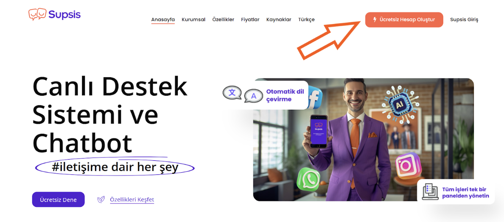

Daha sonra sizi karşılayan ekranın sağ üst tarafında <b>"Ücretsiz Deneyin"</b> butonunu göreceğiz. Bu butona tıklayalım.

Butona tıkladığımız zaman bizden temel bilgileri isteyen bir form belirecek. Şimdi bu bilgileri beraber dolduralım.

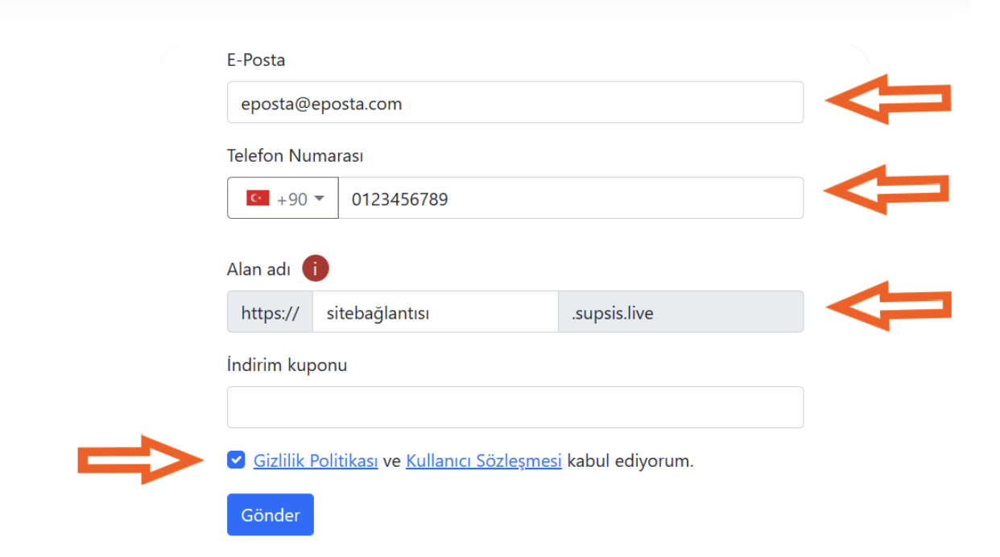

Form içerisinde bulunan alanlara sırası ile e-posta adresimizi, aktif telefon numaramızı ve sitemizin adını yazıyoruz.

Ancak dikkat edilmesi gereken alan <b>“Alan Adı”</b> isimli bölüme sitemizin adını yazarken <b>“www.”</b> veya <b>
“.com”</b> gibi ekler
olmadan sade bir şekilde yazıyoruz. Örneğin; sitenizin adı <b>“www.site.com”</b> ise buraya sadece <b>“site”</b>
yazmalısınız.

En alttaki boş alana ise eğer varsa indirim kuponunuzu girebilirsiniz.

Tüm bilgileri doldurduğumuza göre artık “Gönder” butonuna tıklayarak sonraki adıma geçebiliriz.

Butona tıkladığımız zaman bu sayfadaki işlimiz bitecek ve formdaki e-posta adresimize bir karşılama maili gelecek.

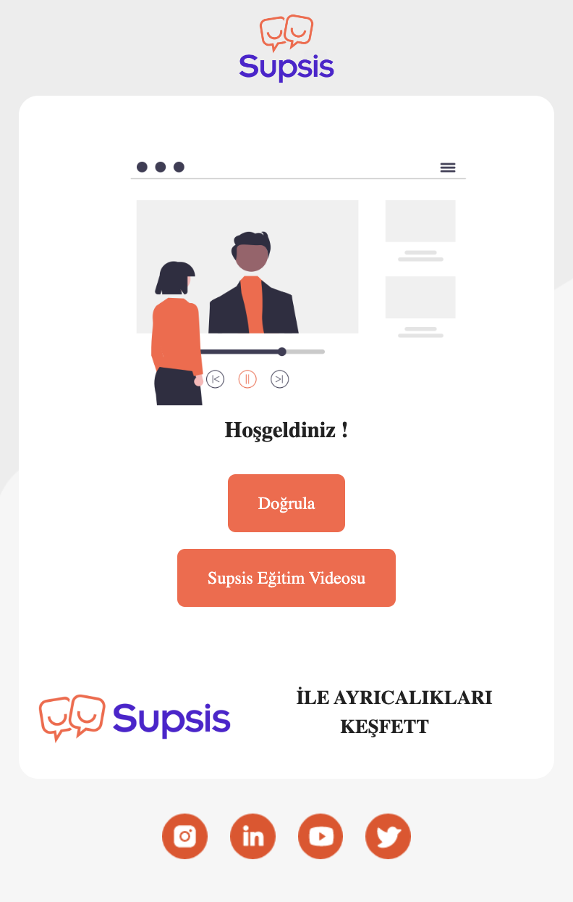

Burada ok ile gösterilen yerde bulunan “Doğrula” butonuna bastığımız zaman tarayıcımızda yeni bir sekme açılacak ve
Ücretsiz Deneme Hesabımız oluşacak.

<b>1-2 dakika kadar panelimizin oluşmasını bekliyoruz.</b>

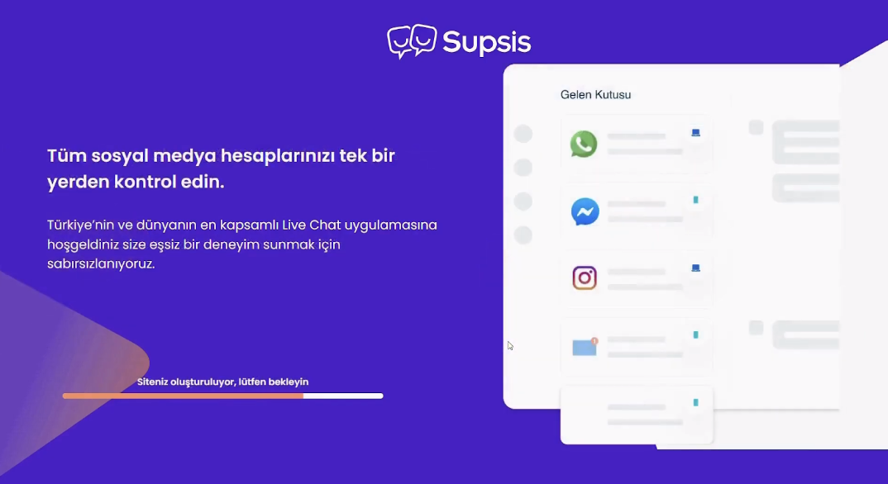

Bu aşamada istenilen bilgileri uygun şekilde doldurup devam ediyoruz.

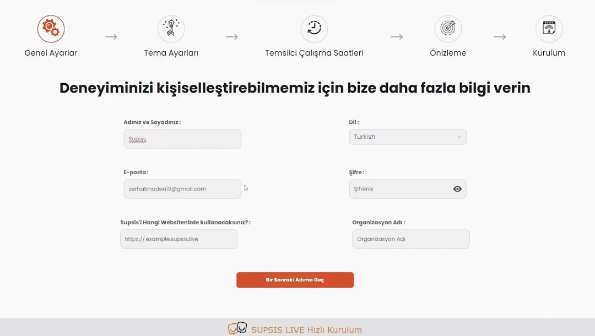

Sonrasındaki ekranımızın adı “Tema Ayarları”. Burada sitemize entegre etmek istediğimiz konuşa balonu ve sohbet
çerçevesi ile ilgili tercihlerimizi yapıyoruz. Burada yaptığımız ayarları daha sonra panel üzerinde de değiştirebiliriz.

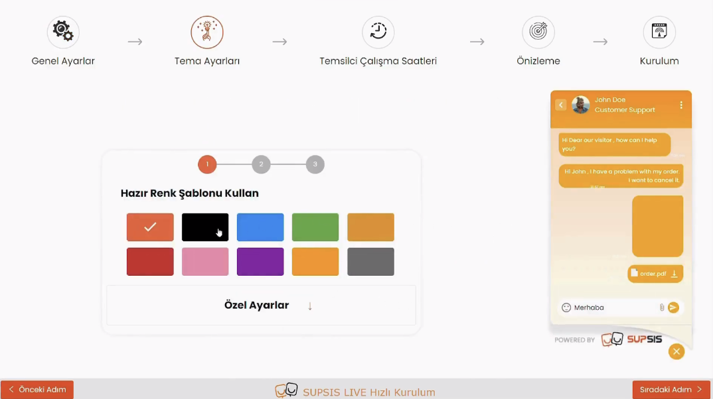

Ziyaretçilerimizin göreceği Sohbet Balonunun rengini, şeklini ve aynı zamanda sohbet çerçevemizin temasını da gördüğünüz
gibi değiştirerek markanızı en iyi yansıttığını düşündüğümüz renklerde yapabiliriz. Ayrıca istediğimiz daha özel bir
renk var ise aşağıda bulunan “Özel Seçim” yazan alana tıklayarak renk paleti içerisinden seçebilir ve bize özel olan
daha kişiselleştirilmiş bir balona da sahip olabiliriz.

Bu alandaki özelleştirmelerimizi de bitirdikten sonra tekrardan sağ alttaki “Sonraki Adım” butonuna basabiliriz.

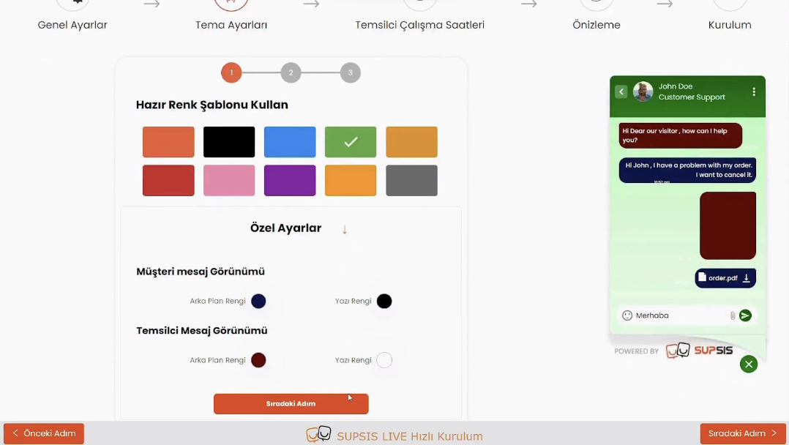

***

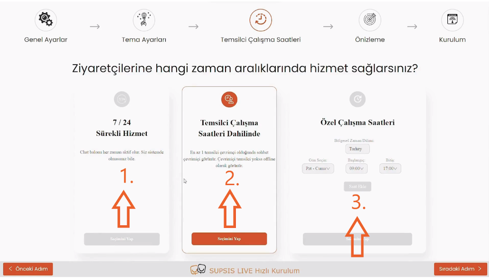

Bu ekranda ise hangi saatler arasında sohbetin online olacağına karar vermeliyiz. Buradaki amaç şudur; belirli saatler
dışında ziyaretçilerimiz gelirse eğer bizim o anda cevap veremeyeceğimizi bilmesi ve bizim cevap vermediğimizi düşünerek
bize karşı güvensizlik duymamasıdır. Bunun için, buradan hangi saatlerde çalışacağımızı seçmemiz gerekiyor. Çalışma
saatleri dışında ise eğer bir ziyaretçi sohbet balonumuza tıklayacak olursa <b>“Hiçbir temsilcimiz şu anda aktif değil.
Size mail yoluyla ulaşmamızı ister misiniz?”</b> şeklinde bir mesaj görecek ve mail adresi bırakması istenecektir. Bu
şekilde bilgi almak amacıyla sitemize giren bir ziyaretçi iletişim kurmadan çıkmamış olacak.

- <b>1.</b>Bu seçenek her zaman sohbetin çevrimiçi olmasını ve asla Çevrimdışı Mesajının gözükmemesini sağlar.
- <b>2.</b>Bu seçenek ise birinci seçeneğe benzer belirli bir saat yoktur ancak çevrimiçi gözükmek için
  temsilcilerinizden en az bir tanesinin “Çevrimiçi” olması gerekmektedir. Eğer tüm temsilcileriniz “Çevrimdışı” ise o
  zaman Çevrimdışı Mesajı aktif olur.
- <b>3.</b>Son seçeneğimizde belirli günler ve saatler arasında seçim yapabiliriz. Bu şekilde belirlediğimiz saatlerin
  dışındaki zamanlarda Çevrimdışı Mesajı aktif olur.

Bunlardan birisini seçtikten sonra tekrardan sağ altta bulunan “Sonraki Adım” butonuna tıklamamız gerekiyor.

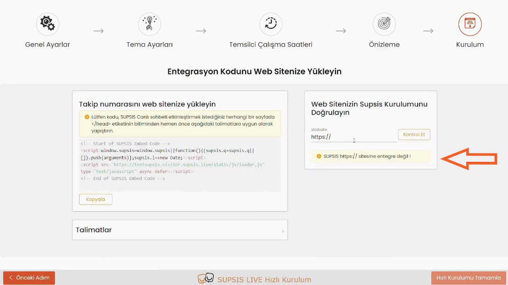

Son ekranımızda ise bize kişiselleştirilmiş Supsis sistemimizi sitemize nasıl dahil edebileceğimiz ile ilgili bilgiler
ve yönlendirmeler bulunmaktadır. Bu konuda Supsis ile iletişime geçerseniz seve seve size yardımcı olunacaktır. Ancak
eğer siz kendiniz yapmak istiyorsanız talimatları takip ederek bu işlemi gerçekleştirebilirsiniz. Sistemi sitemize dahil
ettikten sonra ok ile işaretli alana sitemizin adresini yazabilir ve sistemin doğru şekilde entegre edilip edilmediğini
öğrenebiliriz. Eğer entegre işlemi doğru yapılmadıysa ok işaretli alanın altındaki “Supsis entegre değil!” mesajı ile
karşılaşırız.

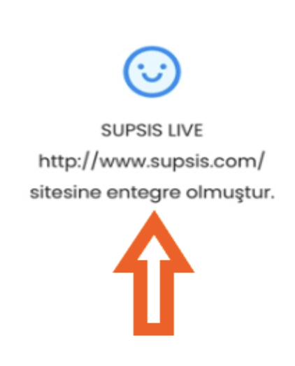

Ancak eğer entegrasyon işlemi başarılı bir şekilde yapıldıysa aynı alanda ok ile işaretli mesajı görürüz. Daha
sonrasında en alt sağda bulunan “Hızlı Kurulumu Tamamla” butonuna bastığımızda kurulum işlemini bitiriyoruz.

***

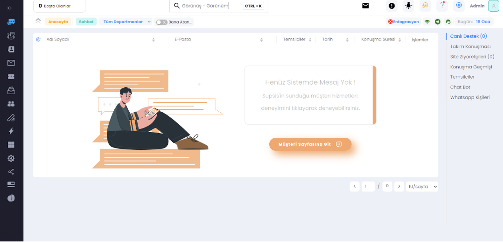

Tüm ayarlamalar tamamlandı ve burası bizim yönetici panelimiz. Artık sistem çalışır durumda ve tüm hareketleri buradan
görüntüleyebiliriz.