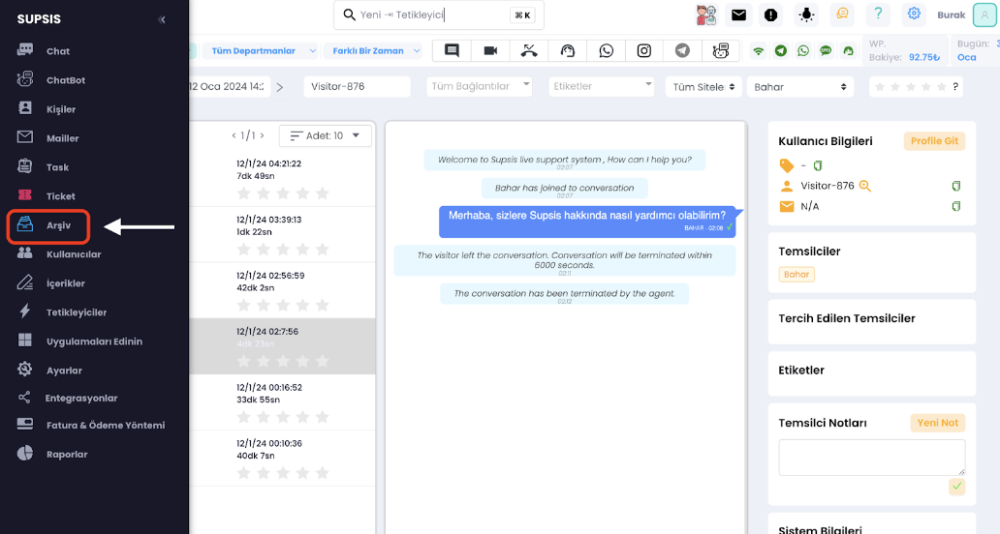
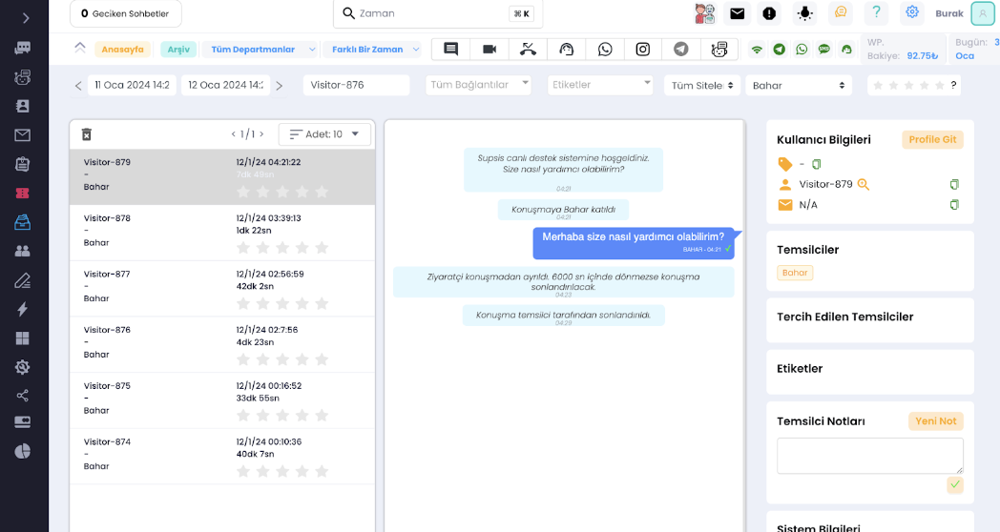
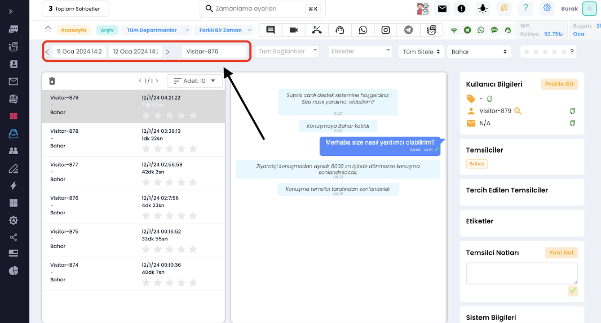
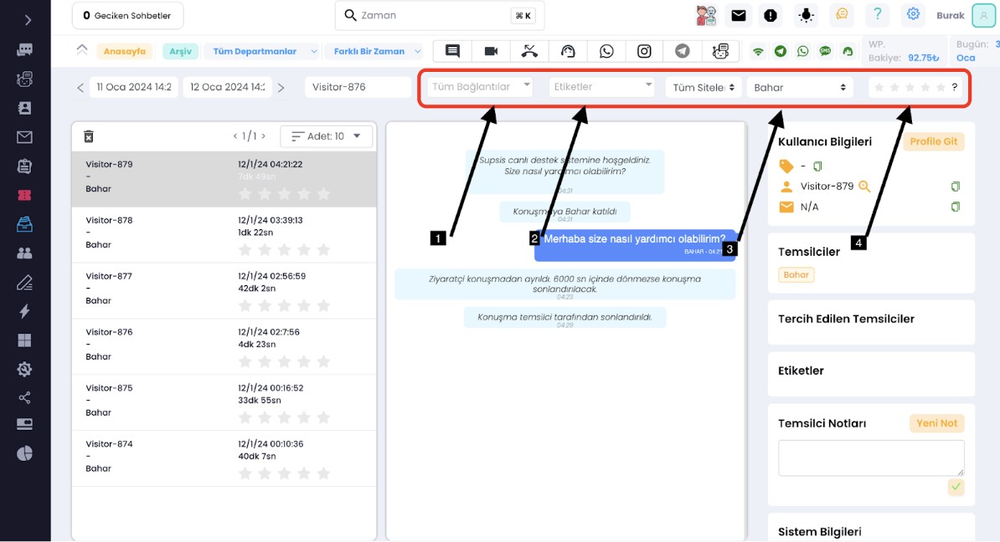

# Geçmiş Bir Konuşmayı Nasıl Görürüm ?

*** 

Geçmiş bir konuşmayı görüntülemek için sisteme giriş yapmalı ve panele giriş yapmış olmalısınız.

Panelden <b>“Arşiv”</b> bölümüne gidelim.

Bu sekmede tüm konuşma geçmişlerini kronolojik bir sırada görebiliriz. Sol kısımda konuşma geçmişleri liste olarak yer
alırken orta kısımda seçili olan konuşmanın içeriği, sağda ise konuşmada bulunan ziyaretçinin bilgileri bulunur.

Buradaki tarih filtrelerini kullanarak belirli bir zaman aralığında gerçekleşen konuşmanızı bulabilirsiniz, hemen
yanında bulunan arama çubuğu ile müşteri adını yazarak kolay bir şekilde aradığınız konuşmayı görüntüleyebilirsiniz.

***

Bu seçeneklerde ise:

<b>1 -</b> İletişim kanalları arasında (Facebook, Whatsapp, Web vb.) göre,

<b>2 -</b> Var ise konuşmaya verdiğiniz etikete göre,

<b>3 -</b> Müşteri ile konuşan temsilcinizi göre,

<b>4 -</b> Konuşmanın aldığı puana göre filtreleme yapabilirsiniz.

