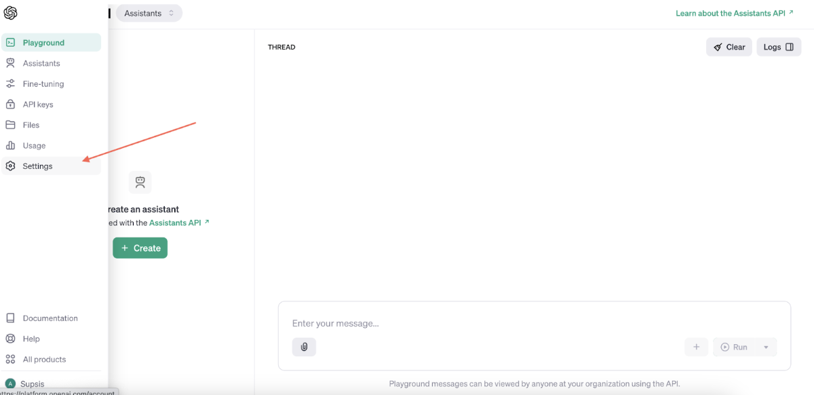
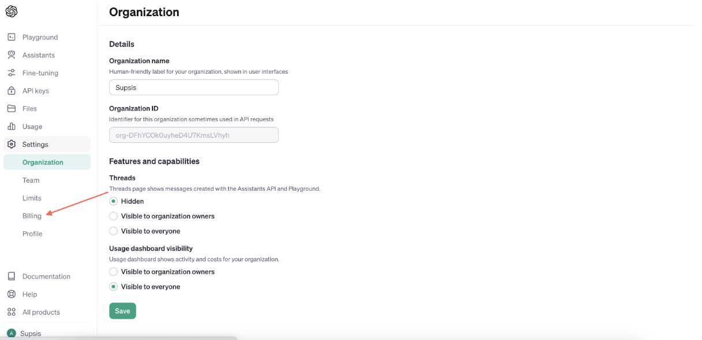
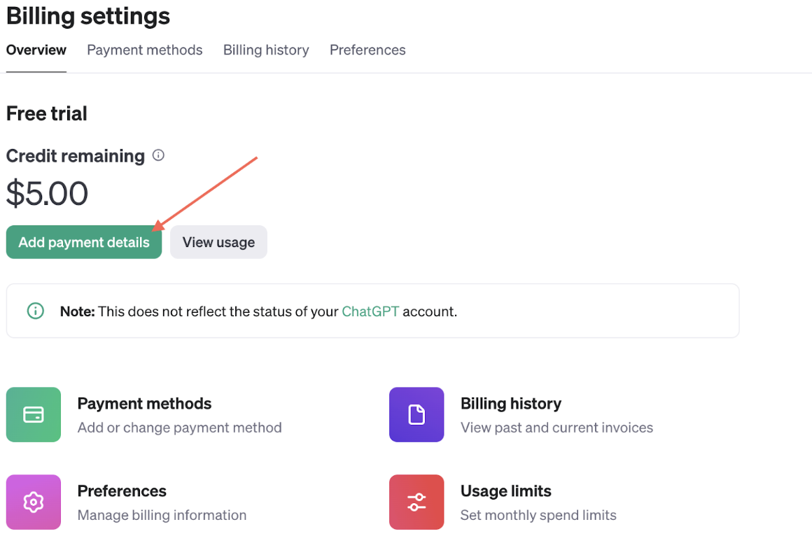
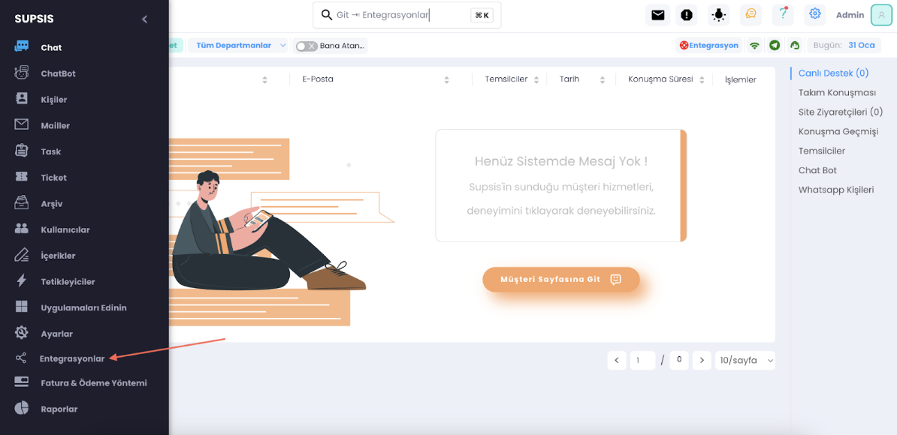
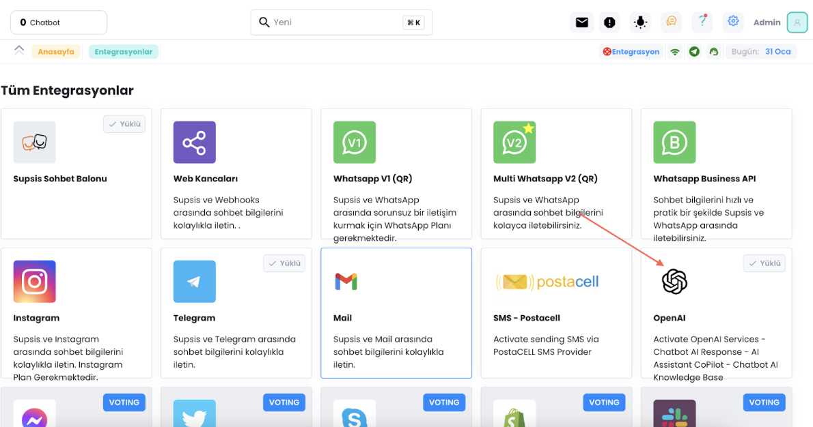
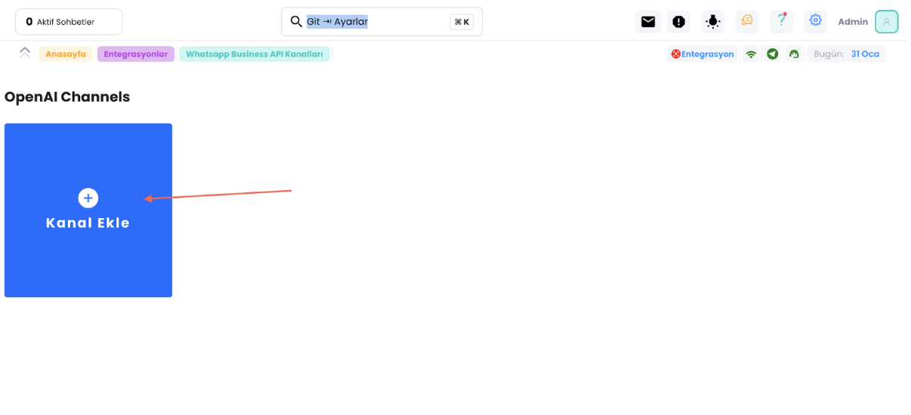
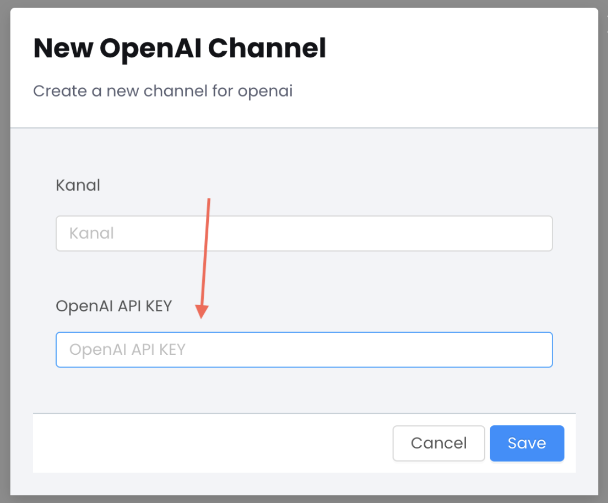

# OpenAI Entegrasyonu Nasıl Yapılır Gereklilikler Nelerdir?

<b>OpenaAI</b> entegrasyonu için öncelikle bir OpenAI API keyine ihtiyacınız var, OpenAı cüzdanınızın içinde minimum 10$
bulunmalı. İşaretli adımları takip ederek cüzdanınıza para yükleyebilirsiniz, limitleri kendinize göre düzenleyin.

***

***

***

<b>Eğer herşey hazırsa Supsis panelinize girip işaretli adımları izleyiniz.</b>

***

***

***

***

İşaretli kısma OpenAI keyinizi girin ve kanal adınızı kendinize göre tanımlayın, işlem tamamdır.
