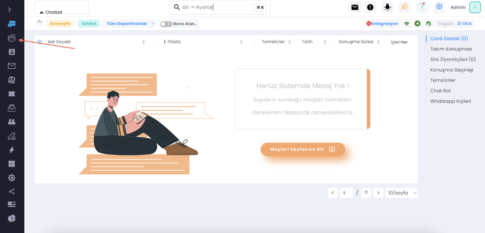
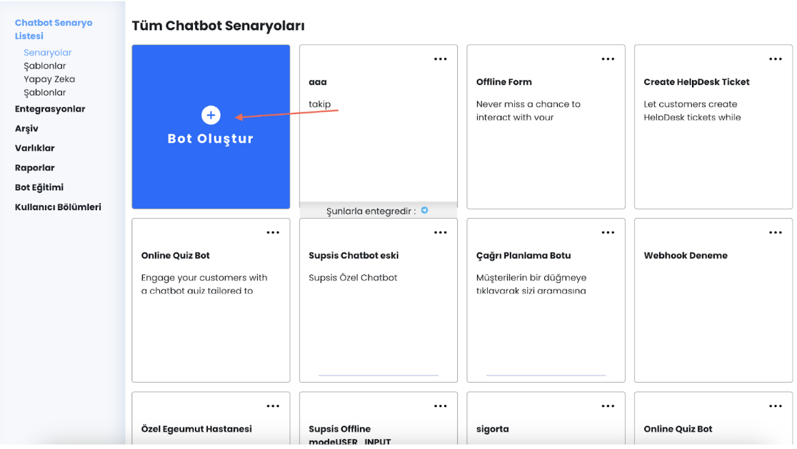
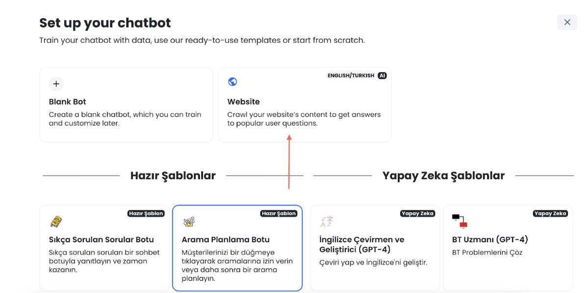
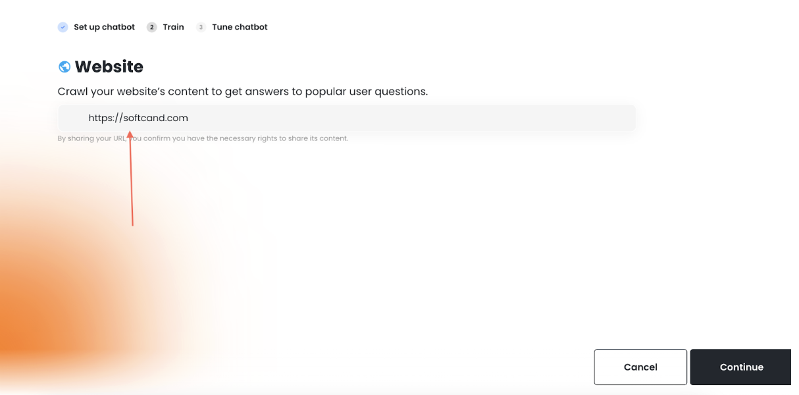
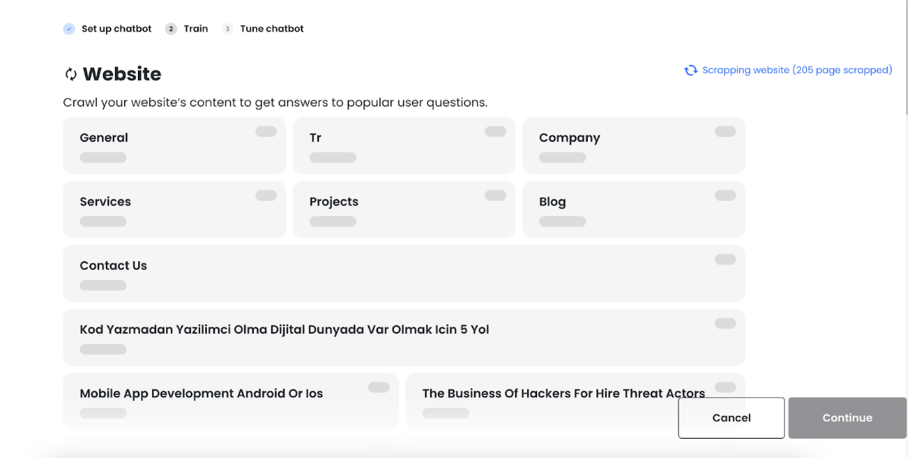
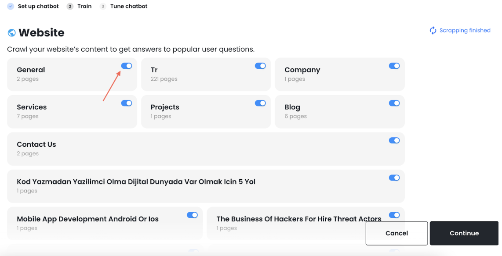
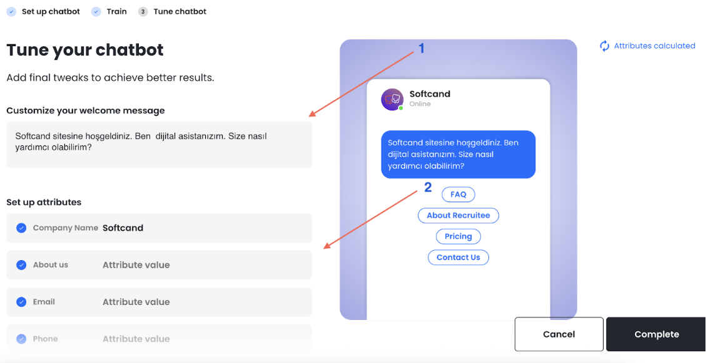
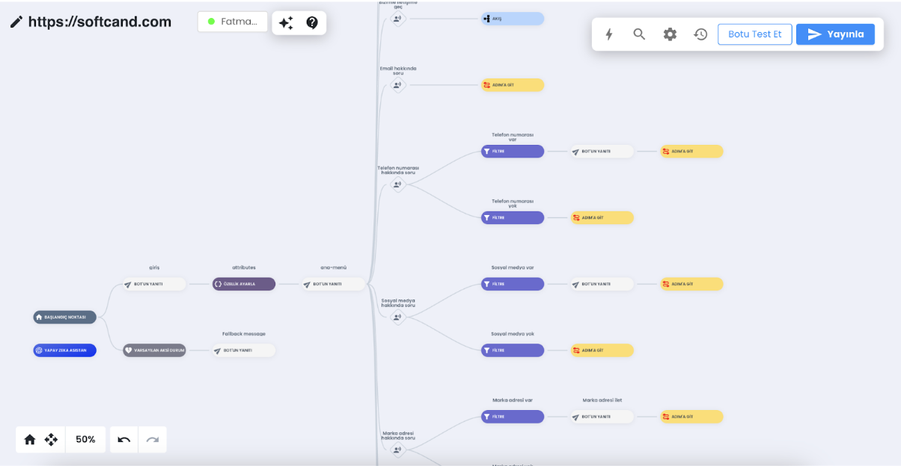

# Otomatik Chatbot Nasıl Oluşturulur ve OpenAI Fiyatlandırması

<b>Panelimizin sol kısmından işaretli chatbot alanına giriyoruz.</b>

<b>İşaretli bot oluştur butonuna tıklıyoruz.</b>

Açılan kısımdan websiteyi seçiyoruz

Website adresinizi yazarak continue butonuna tıklıyoruz.

Yapay zekanın websitenizi taramasını bekliyoruz. Bu işlem bir kaç dakika sürebilir.

***

Taramanın tamamlanmasını bekleyin, datadan çıkartmak istediğiniz bölümleri işaretli tikleri açıp kapatarak, ekleme
çıkartma yapabilirsiniz. Bu kısım önemli çünkü yapay zeka müşterilerinize burdan çektiği datalarla cevap verir,
çıkardığınız bölümleri datasından siler. Örneğin website etkileşiminizi arttırmak için websitenizden alakasız yazdığınız
blog vs varsa bu kısımdan kaldırabilirsiniz. Herşey hazırsa continue butonuna basın, bastıktan sonra chatbot eğitmi için
biraz bekleyelim.

***

1 numaralı okun gösterdiği kısımdan chatbotun ilk mesajını özelleştirebilir,
2 numaralı oktan chatbotun datalarını güncelleyebilir ve değiştirebilirsiniz. Hazır olduğunda complete butonuna
tıklayınız.

Chatbotunuz hazır, yapay zeka asistanımız ile aktif bir şekilde chatbotunuzu kullanabilirsiniz.

***

# OpenAI Fiyatlandırması

ChatGpt token kullanarak çalışır
Her oturumda müşteri ortalama 2 kere yapay zeka asistanına gitse
tahmini 200~300 token yapar
1000 token ücreti 0.03 $

100 chat için ortalama bir fiyat
100 chat * 200 token = 20.000 token = 0.6$
Ayda toplam 1000 chat için yapay zeka soru cevap 6$ ~ (bu soru ve cevap uzunluğuna göre değişebilir)
OpenAI’a yüklenilen 1 GB’lık website data maaliyeti= 6$
(Bunlar ortalama fiyatlardır değişkenlik gösterebilirler daha detaylı bilgiye bu linkten
ulaşabilirsiniz: https://openai.com/pricing )

