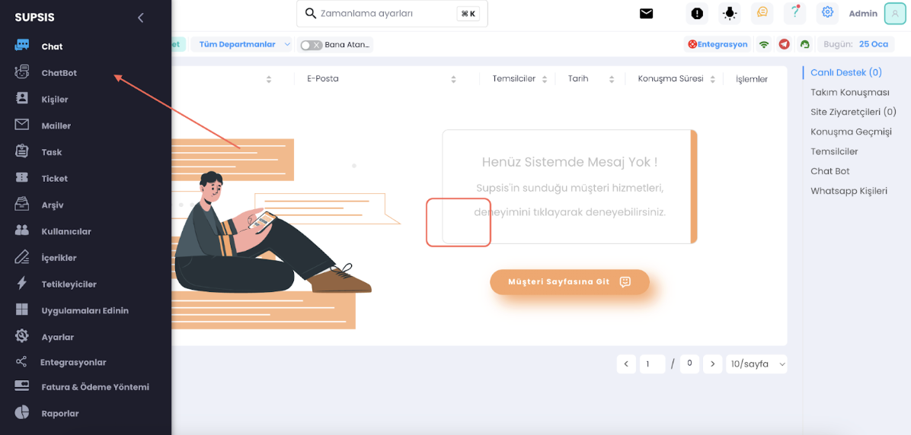
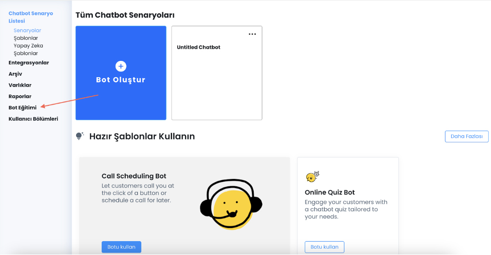
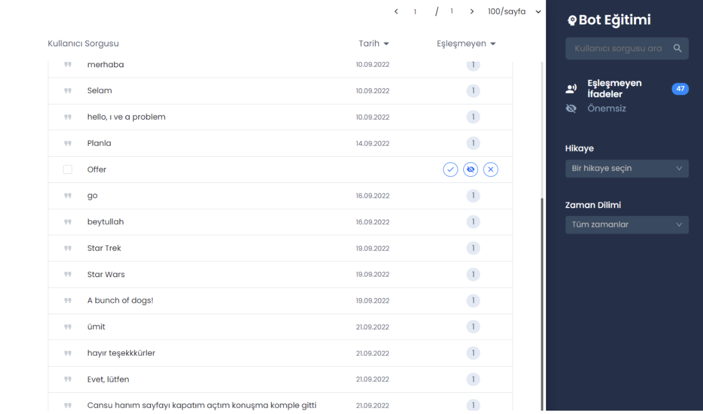
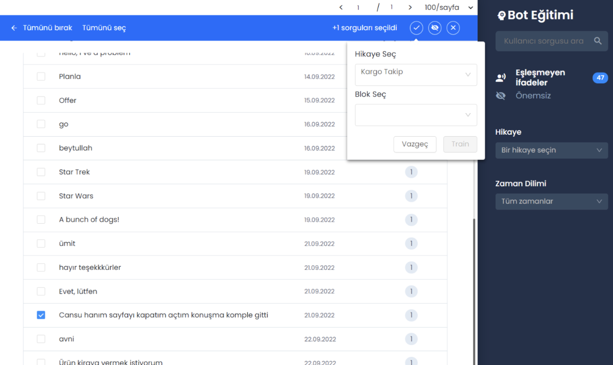
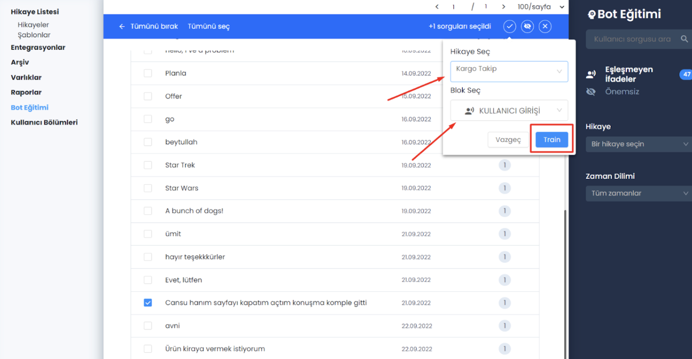
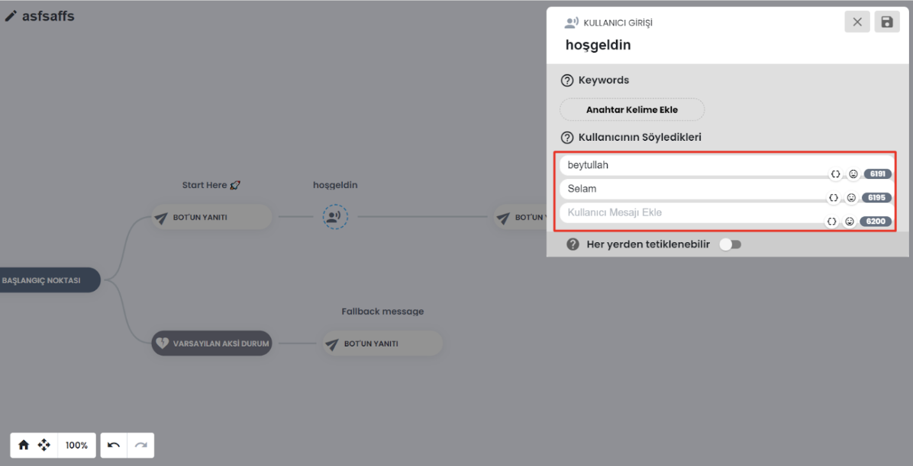

# Kullanıcı Mesajı Yakalama ve Bot Eğitimi

Kullanıcı mesajı yakalama ve bot eğitimi chatbot konusu oldukça önemlidir. Bir chatbot, insanlarla etkileşim kurabilen
bir yazılım programıdır. Chatbotlar, kullanıcıların sorularını cevaplamak, önerilerde bulunmak, hizmetler sağlamak,
siparişler almak veya yardım etmek gibi birçok görev için kullanılabilir.

Chatbotlar, doğru şekilde eğitilmezse, kullanıcılara yanıt veremeyebilir, yanlış yanıtlar verebilir veya hiç yanıt
vermeyebilirler. Bu nedenle, chatbotun doğru bir şekilde eğitilmesi çok önemlidir. Chatbot eğitimi iki ana bölümden
oluşur: kullanıcı mesajı yakalama ve bot eğitimi.

***

# Kullanıcı Mesajı Yakalama

Chatbotların temel görevi, kullanıcılardan gelen mesajları anlamak ve uygun bir şekilde yanıt vermek için
tasarlanmıştır. Kullanıcıların mesajlarını doğru bir şekilde yakalamak, chatbotun doğru bir şekilde yanıt vermesi için
önemlidir. Chatbotların kullanıcı mesajlarını yakalamak için bazı teknolojiler kullanır, örneğin doğal dil işleme (NLP)
veya makine öğrenmesi (ML) gibi teknolojiler.

***

# Bot Eğitimi:

Chatbotların doğru bir şekilde yanıt vermesi için eğitilmesi gereklidir. Bot eğitimi, chatbotun, doğru bir şekilde yanıt
vermesi için kullanılacak verilerin toplanması ve analiz edilmesini içerir. Bu veriler, chatbotun eğitiminde
kullanılacak olan metin, resim, ses ve video gibi verileri içerebilir.

Bot eğitimi, chatbotun doğru bir şekilde yanıt vermesi için kullanıcılardan gelen soruların önceden tanımlanması ve
bunlara uygun yanıtların oluşturulması gerektirir. Chatbotlar, birçok kullanıcı mesajını işleyebilir, bu nedenle bot
eğitimi sürecinde, chatbotun, kullanıcıların mesajlarını doğru bir şekilde anlaması için birçok senaryo ve senaryoların
yanıtları oluşturulmalıdır.

Sonuç olarak, kullanıcı mesajı yakalama ve bot eğitimi, chatbotların doğru bir şekilde yanıt vermesi için kritik öneme
sahiptir. Chatbotlar, doğru bir şekilde eğitildiğinde, kullanıcılara yardımcı olabilir, hizmetleri sağlayabilir ve
işletmelere birçok fayda sağlayabilir.

***

<b>Şimdi kullanım aşamalarına geçelim.</b>

Öncelikle panelimizden gösterilen kısıma basalım ve <b>ChatBot'u</b> açalım.

Dana sonra <b>Bot Eğitimine</b> basalım

Karşınıza çıkan sayfada kullanıcılara ait mesajlar bulunuyor.

İstediğimiz soruyu seçip yukarda bulunan tik işaretinize basabiliriz.

Açılan kısımda fotoğrafta da göründüğü gibi işaretlenen yerlerden hikayemizi ve bloğumuzu seçebiliyoruz.

Seçtiğimiz soru bu şekilde kullanıcının söyledikleri kısmında gözükecektir.

Bu şekilde botumuzu eğiterek müşterilerinizlle daha faydali iletişim kurmasını sağlayabilirsiniz.

Supsis görüldüğü gibi kullanımı bu kadar basit bir arayüze sahip. Eğer herhangi bir sorun yaşarsanız websitemizi
ziyaret ederek destek ekibimiz ile <b>7/24</b> [burdan](https://www.supsis.com) iletişime geçebilirsiniz, sorununuzu
çözmekten mutluluk duyarız.

