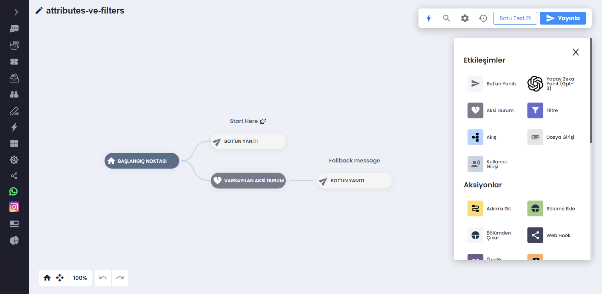
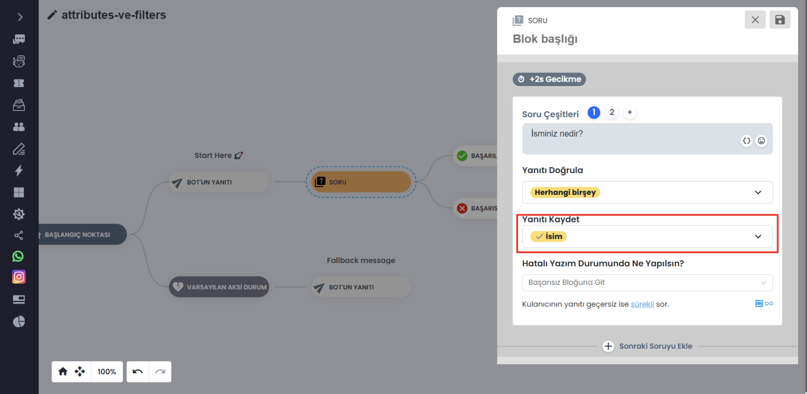
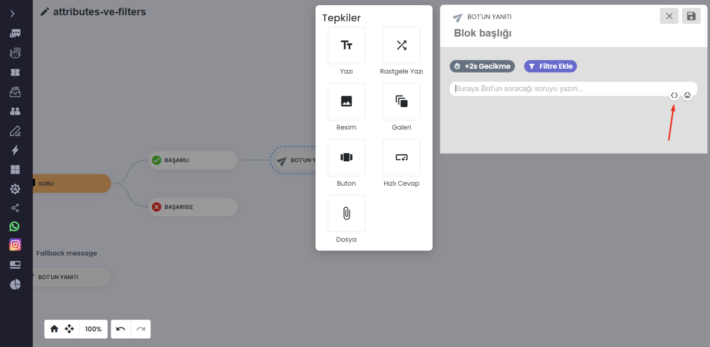
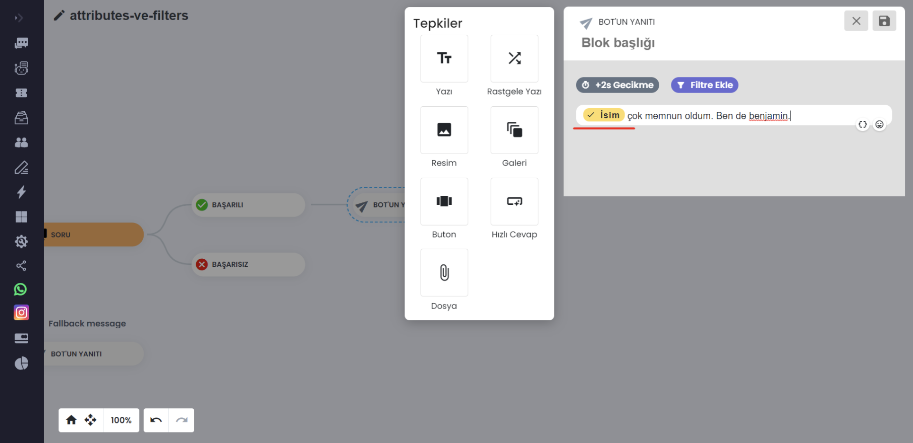
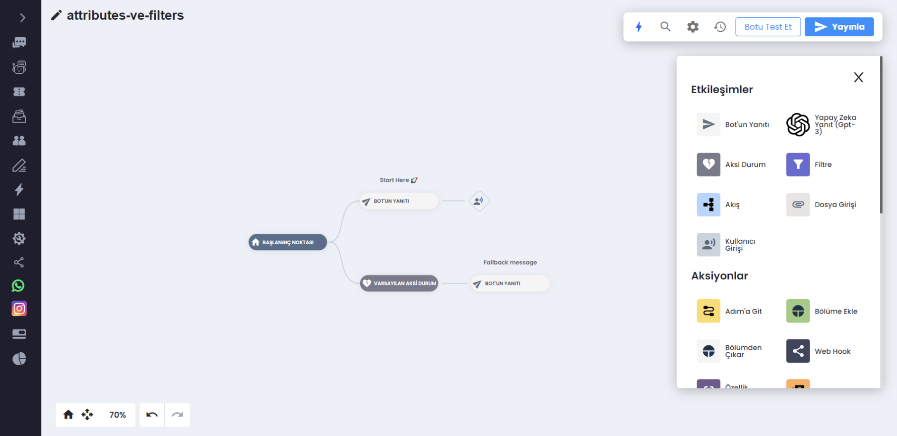
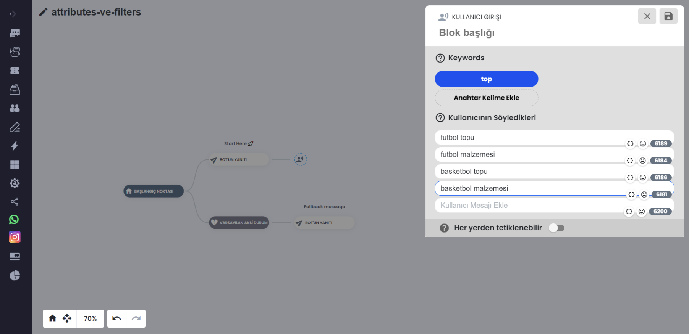
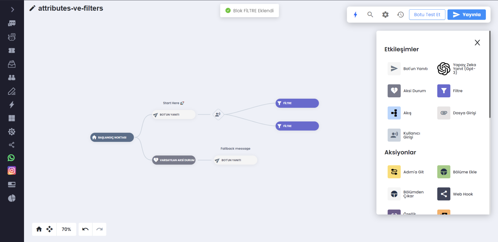
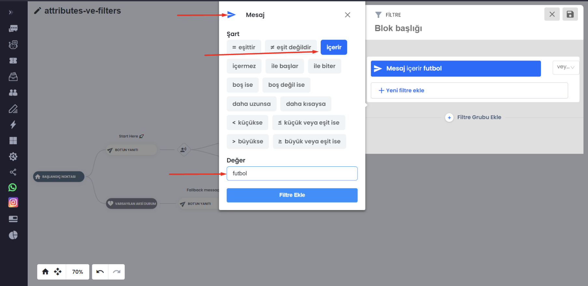
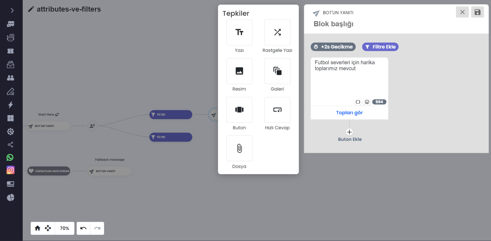
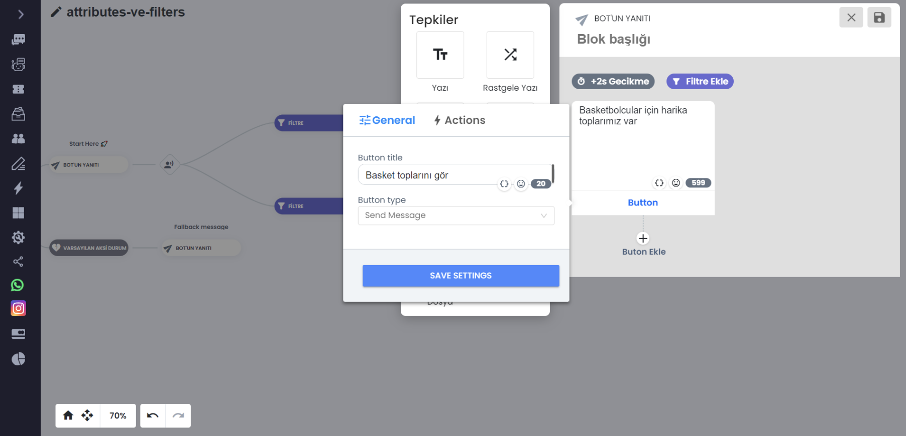

# Özellikler ve Filtreler

## Özellik Ayarla

Özellikler, sohbet botlarının kullanıcılarla daha kişiselleştirilmiş bir şekilde etkileşim kurmasına olanak tanıyan
önemli bir özelliktir. Özellikler, kullanıcılara veya sohbetlerdeki diğer varlıklara bilgi atayarak, bu bilgileri web
hizmetlerine aktararak veya sohbetleri özelleştirerek kullanılabilir.

İki tür öznitelik vardır: Varsayılan Özellikler ve Kullanıcı Özellikleri. Varsayılan Özellikler, kullanıcılara önceden
tanımlanmış bilgileri otomatik olarak toplama özelliği sağlar. Örneğin, kullanıcının adı, soyadı, cinsiyeti, avatarı
gibi bilgiler varsayılan Özelliklerdir ve yalnızca bot yanıtları için kullanılabilirler.

Kullanıcı Özellikleri ise, kullanıcılar veya diğer sistem varlıklarıyla ilişkili olan Özelliklerdir. Kullanıcı
Özellikleri, botun sohbeti özelleştirmek için kullanabileceği ve hatta web hizmetlerine aktarabileceği herhangi bir
bilgiyi temsil edebilir. Örneğin, bir kullanıcının önceden tanımlanmış bir konuma veya tercihlerine göre özel bir teklif
sunmak için kullanıcı Özellikleri kullanılabilir.

Nitelik ayarla eylemi, senaryonun herhangi bir adımında özel Özellikler atamak için kullanılabilir. Soru eylemi ise,
kullanıcının kimliğini doğrulamak ve Özellikleri toplamak için kullanılabilir.

Tüm bot yanıtlarına, başlıklar ve düğmeler dahil olmak üzere nitelikler eklenebilir. Niteliği seçmek için süslü parantez
sembolüne tıklanabilir veya çift süslü parantez yazılabilir. Bu şekilde, özellikle kullanıcı Özellikleri, bot
yanıtlarında kullanılabilir ve bot, kullanıcının tercihlerine veya önceden tanımlanmış bilgilerine göre özelleştirilmiş
yanıtlar verebilir.

- Öncelikle senaryomuza girelim.

- Deneme amaçlı kısa bir senaryo oluuşturalım. Bu örnekte soru sordurarak "özellik" adındaki aksiyonu kullancağım.
  Mesela burada bir bir adet soru sorma aksiyonu bağladım ve ismini sordum. Kırmızı çerçeve ile belirttiğimiz kısımda da
  cevabını hangi özellikte kaydetmemiz gerektiğini seçeceğiz. Örnekte isim olarak seçtim ve kaydet diyerek devam
  ediyoruz.

- Ucuna kullanıcıya cevap verebilmesi için bir bot yanıtı koyuyorum ve belirttiğimiz özelliğimizi yazarak cevap
  veriyorum. Kullanıcı ne cevap verdiyse otomatik olarak botumuz kullanmış olacak.

## Filtre

***

Filtreler, chatbotun belirli bir yanıtı veya eylemi gönderip göndermeyeceğine ve ne zaman gönderileceğine karar
vermenizi sağlayan özelliklerdir.

Filtreler, chatbotun topladığı kullanıcı bilgilerine ve botun öğrendiği bilgilere dayanarak farklı yanıtlar ve eylemler
tetiklemek için kullanılır. Örneğin, chatbotunuz geri dönen bir müşteriye veya belirli bir web sayfasına tıkladıktan
sonra gelen bir kullanıcıya farklı mesajlar gösterebilir.

Chatbot filtreleri farklı türde olabilir:

Özellik Filtresi: Varsayılan veya özel özellikleri kullanarak belirli bir eylem veya yanıtı tetikleyebilirsiniz.

Mesaj Filtresi: Kullanıcı girişine göre belirli bir eylemi veya yanıtı tetikleyebilirsiniz.

Özel Filtre: Kendi koşullarınıza göre filtreler oluşturabilirsiniz.

Chatbot filtreleri, bir bot yanıtına veya eylemine birden fazla filtre uygulayarak kullanılabilir. Bot yanıtları veya
eylemleri, yalnızca sorgu filtrelerdeki koşulları karşıladığında kullanıcılara gösterilir.

Filtrelerin kullanımı örneklerle açıklanmaktadır. Örneğin, mesaj filtresi kullanarak, chatbotunuzu futbolcuların futbol
topu araması yaparken ve basketbolcuların basket topu araması yaparken farklı konuşma yolları oluşturmak için
kullanabilirsiniz.

- Öncelikle senaryomuzu açalım ve bir adet kullanıcı girişi bağlayalım.

- Daha sonra anahtar kelime ve kullanıcının söyleyebileceklerini yazalım.

- Oluşturduğumuz kullanıcı girişine 2 adet <b>"Filtre"</b> ekleyelim.

- Oluşturduğumuz filtereye basalım ve açılan pencerede üst taraftan mesaj değerini yazıp şartı eşittir yapalım. Alttaki
  kısımda da değer olarak "futbol" girelim. Böylece futbol kelimesi yazınca filtreden geçerek buraya aktaracak.

- Aynısını diğer filtre için de yapalım. Bu sefer basketbol yazalım ve "filtre ekle" diyerek devam edelim.

- Bu filtrelere bot yanıtı ekleyelim ve ve botun yazması istediği şeyi yazalım. İkinci filtreye de bot yanıtı ekleyip
  aynı şekilde botu konuşturalım.

<b>Kısacası filtre ekleme bu kadar. Aşağıdaki video ile sonucu görebilirsiniz.</b>

<video width="100%" height="100%" controls>
    <source src="https://static.supsis.live/common/doc.supsis.live/supsisfiltre.mp4" type="video/mp4">
    Your browser does not support the video tag.
</video>

***

Supsis görüldüğü gibi kullanımı bu kadar basit bir arayüze sahip. Eğer herhangi bir sorun yaşarsanız destek ekibimiz
sizinle her zaman iletişime geçebilir. Sizin sorununuzu çözmekten mutluluk duyarız. Çünkü kullanıcılarımız bizler için
çok önemli. Supsis web sitemize [burdan](https://www.supsis.com) ulaşabilir ve destek talep edebilirsiniz. 

