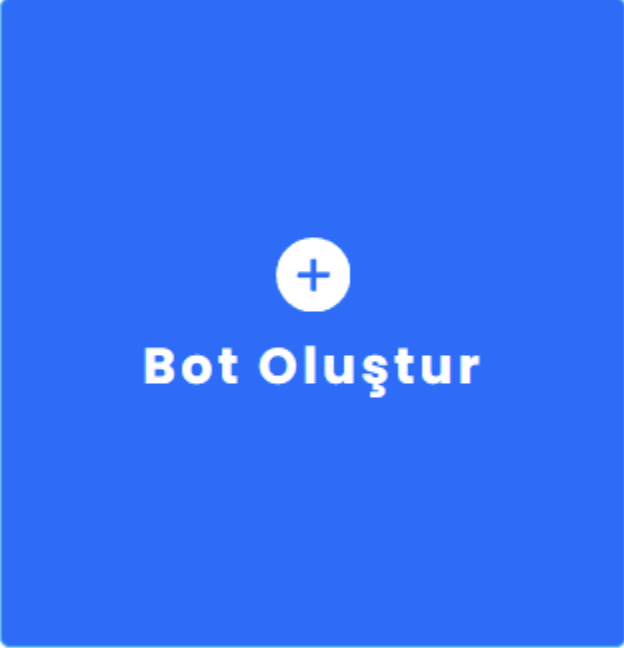

# Manuel Chatbot Oluşturma

Botunuzu oluşturmak için aktif bir Supsis hesabınızın olması gerekir. Hesabınızı oluşturmak
için <a href="https://supsis.com/tr/ucretsiz-hesap/" target="_blank">
demo oluşturma
sayfasını</a> ziyaret edin ve yeni bir demo kullanıcı olarak kaydolun. Supsis, 50 chat ücretsiz deneme sürümü sunar,
böylece
bu kullanım zarfında botunuzu kullanabilirsiniz. Hadi yolculuğa başlayalım!
***

***

Hesabınızı oluşturduktan sonra, yeni bir hikaye oluşturabileceğiniz ChatBot sekmesine gideceksiniz. Bot oluştur
düğmesine tıklayın

***

Sistemimizin özelliklerinden biri olan yapay zekaya websitenizi taratarak size uygun bir chatbot oluşturabilirsiniz (2).
Blank Bot’a tıklayarak da manuel olarak chatbot oluşturabilirsiniz (1), hadi beraber oluşturalım!

# 1-) Manuel Chatbot Oluşturma

***

Yeni hikayenizin hikaye adını istediğiniz şekilde değiştirebilirsiniz.

İlk hikayenizi oluşturduktan sonra bu sayfada kendinizi bulacaksınız sonra senaryo alanında vermiş olduğunuz isimli
senaryo veya Bot oluşturuken vermiş olduğunuz senaryo yer alacaktır. Üzerine tıklayarak ChatBot Düzenleme bölümüne
aktarılacaksınız . Varsayılan olarak, başlamanıza yardımcı olmak için orada temel bir konuşma ağacı hazırladık.
Panelinizin chatbot sayfasına girerek yukardaki chatbota tıklayarak örneği inceleyebilirsiniz.

***

<b>Başlangıç noktası</b> , hikayenizin nerede başladığını gösterir. Bu, düzenlenemeyen bir noktadır. Ayrıca,
kullanıcıları
karşılamak için okla işaretli botun yanıtına varsayılan bir Hoş Geldiniz/Hello mesajı ekledik. İstediğiniz gibi
düzenleyebilirsiniz. Bu fırsatı bir kullanıcının dikkatini çekmek için kullanalım! Düzenleme penceresini açmak için
Bot’un yanıtı bloğuna tıklayın . Karşılama mesajının 6 çeşidini hazırladık.Türkiyede bir ilk olan “Yapay Zeka Asistanı”
sistemimiz ChatGpt aracılığıyla müşterilerinizi özel hissetirebilirsiniz.

***

# Bot'un Yanıtı bloğu ne işe yarar ?

<b>Bot yanıt bloğu ,</b> sohbet robotunuzun bir kullanıcıya gönderdiği bir mesajı içerir. Burada kullanıcıya bir soru
sorabilir
veya önceden tanımlanmış cevaplar arasından seçim yapmasına izin verebilirsiniz. 6 özellik mevcuttur. Bu özellikleri
nasıl kullanacağınız ihtiyacınıza göre belirleyebilirsiniz.

Özellikler:

- Yazı --- Normal bir mesaj yanıtı göndermenize yarar.
- Rastgele Yazı --- Bu özellik sayesinde eklediğiniz farklı tip ama aynı mesaj içeriğine sahip olan mesajlarınızı 1 2 3
  istediğiniz kadar ekleyebilirsiniz bu özellik arasından rastgele seçtiği mesajı kullanıcıya gönderir.
- Resim --- Kullanıcıya resim gönderir.
- Galeri --- Kullanıcıya bir galeri şeklinde yan yana resim ve mesaj içerikli olan butonlu bir katalog gönderir.
- Buton --- Kullanıcının tıklayabileceği mesaj içerikli olan butondur.
- Hızlı Cevap --- Kullanıcının tıklayacağı butondur. Normal Buton özelliğinden farkı ise daha küçük mesaj içerikli
  olmasıdır.

Hadi gelin sizinle örnek bir uygulama gerçekleştirelim :) Bu adıma kadar geldiğinize emin olun bu süreçten sonra kendi
düzenlemelerimizi yapacağız.

Soldaki menüden bir Resim yanıtı seçin ve tıklayın. Ardından, kullanıcılara göstermek istediğiniz resmi yükleyin.

***

***

Ardından, menüden başka bir Metin yanıtına tıklayın. Bu işlem kullanıcıya resimden 2 saniye sonra bir mesaj metni daha
gönderecektir. Bu sanki sizden giden başka bir mesaj metni olarak kullanıcıya iletilecektir. Kullanıcıya daha erken veya
daha geç bir şekilde mesajın gitmesini istiyorsanız gecikme yazan bloğa tıklayarak gönderilecek mesajın süresini
isteğinize göre uzatıp kısaltabilirsiniz.

Ardından, menüden “Yazı”ya tıklayın. Bu işlem kullanıcıya resimden 2 saniye sonra bir mesaj metni daha gönderecektir. Bu
sanki sizden giden başka bir mesaj metni olarak kullanıcıya iletilecektir. Kullanıcıya daha erken veya daha geç bir
şekilde mesajın gitmesini istiyorsanız “+2s Gecikme” yazan bloğa tıklayarak gönderilecek mesajın süresini isteğinize
göre uzatıp kısaltabilirsiniz.

Ardından, bir hızlı yanıt ekleyelim. Burada, kullanıcıya sitenize kaydolmak isteyip istemediğini sorabilirsiniz. Örneğin
bir kupon kodu sunarak kullanıcıyı bunu yapmaya teşvik edebilirsiniz. Uygun buton tipini seçerek işleme devam ediyoruz.
Bu işlem kullanıcının karşısına ekleyeceğiniz butonlara göre seçim yapabileceği bir ekran çıkartacaktır. Hazır
olduğunuzda tüm ayarları ve düzenlemelerinizi kaydetmek için oluşturduğunuz chatbot adımının sağ üstündeki kayıt
butonuna tıklayın.

Şimdi sıra <b>kullanıcı girişinde.</b> Sohbete devam etmek için etkileşimler menüsünden Kullanıcı girişi bloğunu seçin
ve Bot
yanıtı bloğunun sonrasına bırakın. Sürükleyip bırakabilirsiniz veya bloğun sağında yer alan <b>(+)</b> simgesine
tıklayarak istediğiniz özelliği ekleyebilirsiniz.

***

Kullanıcı giriş bloğu , kullanıcı yanıtlarını toplamanıza olanak tanır. Bu blokta, ne tür kullanıcı mesajlarının botun
yanıtını tetikleyeceğini tanımlamanız gerekir. Kullanıcı girişi oluşturmak için Anahtar Kelimeleri ve Kullanıcının
söylediğini tanımlamanız gerekir . Bunlar, aralarından seçim yapabileceğiniz eşleştirme sistemleridir. Kullanıcı girişi
botumuzun kullanıcıya gönderdiği mesajlardan sonra kullanıcıdan bir işlem yapması için bekleyecektir. Bu işlem
kullanıcının butona tıklamasını bekleme veya kullanıcıdan beklenecek bir mesaj olabilir. Bot kullanıcıdan bir aksiyon
gelinceye kadar diğer bir işleme geçmeyecek kullanıcıdan gelen aksiyona göre başka bir işleme geçecektir. Bundan sonra
yapılacak işlem kullanıcıya farklı bir mesaj yada kullanıcıdan gelecek aksiyona göre çok daha farklı işlemler olarak
gerçekleştirebilirsiniz. Önemli olan şu an Kullanıcıdan beklenen bir işlem ve bu işlem veya cevap gerçekleştirilene
kadar botumuz diğer bir işleme geçmeyecektir.

Botunuzun belirli bir anahtar kelimeye yanıt vermesini istiyorsanız, Anahtar Kelime eşleme sistemini kullanın.
Kullanıcıların daha uzun ifadeler kullanarak yanıt vermesini bekliyorsanız, Kullanıcının söyledikleri alanını kullanın.
Yanıtınız hazır olduğunda, <b>kaydet</b> butonuna tıklayın.

Şimdi, kullanıcının e-postasını almak isteyelim. Ana menüden Soru bloğunu sürükleyin ve Kullanıcı giriş bloğundan sonra
bırakın.

<b>Soru bloğuna tıklayın ve müşteriye göndermek istediğiniz mesajı yazın.</b>Soru çeşitleri kısmının yanındaki +
butonuna basarak buraya daha fazla varyant ekleyebilirsiniz. Bu şekilde, kullanıcı yanlış e-posta formatı sağladığında,
bot uygun e-posta formunu tekrar sormak için farklı kelimeler kullanır. Bunu yaparak chatbotunuzu daha doğal hale
getirebilirsiniz. Yanıtı doğrula alanından e-posta‘yı seçin. Bu sayede, sohbet robotunuz, kullanıcının e-posta adresinin
uygun biçimini sağlayıp sağlamadığını bilecektir. Yanıtı kaydet alanında, varsayılan e-posta özniteliğini ayarlayın. Bu
şekilde, kullanıcı doğru e-posta adresini verirse ChatBot bu e-posta adresini kullanıcıya atayacaktır.Ardından,
Başarısızlık durumunda eylem bloğunda, bir kullanıcı e-postalarının doğru biçimini yazamazsa botunuzun ne yapacağını
seçebilirsiniz. <b>Başarısızlık bloğuna git</b> seçeneğini belirlerseniz , bot yanlış e-posta adresi biçimini kaydetmez
ve
kullanıcıdan e-postalarının uygun biçimini sağlamasını tekrar ister. Ardından, doldurduktan sonra Yeniden Dene’yi seçin,
böylece botunuz doğru yanıtı alana kadar denemeye devam eder. Hazır olduğunuzda, kaydet ve kapat’ı tıklayın.

Şimdi, kullanıcıya e-posta adresi için teşekkür edelim. Bunu yapmak için, ana menüden <b>Bot Yanıt’ını</b> seçin ve
sürükleyin,
Başarılı bloğundan sonra bırakın.

- Bloğun adını yazın (1)
- Bir Resim yanıtı ekleyin ve kullanmak istediğiniz bir resmi yükleyin (2)
- Son olarak, bazı metin yanıtları ekleyin mesajlarınızı girin (3)
- Hazır olduğunuzda, kaydet ve kapat’ı tıklayın. (4)

***

***

Şimdi, kullanıcının sitenize kaydolmak istememesi durumunda botun mesajını hazırlamanız gerekiyor. Bunu yapmak için ,
ana menüden <b>Kullanıcı girişini</b> sürükleyin ve Hoş Geldiniz mesajından sonra bırakın.

<b>Kullanıcı girişi</b> bloğunun içini uygun şekilde doldurun. Kullanıcı giriş bloğuna tıklayın ve dilerseniz bloğun
adını
yazın. Ardından, Anahtar Kelimeler veya Kullanıcının söyledikleri alanlarını kullanarak kullanıcı yanıtlarını girin .
Kullanıcılarınızın gönderebileceği tüm olası yanıtları yazın. Hazır olduğunuzda, kaydet’e tıklayın.

Bot’un Yanıtı bloğunu ana menüden sürükleyin ve bülteninize kaydolmayı reddeden Kullanıcı girişinden sonra bırakın.

***

- Bot yanıt bloğuna tıklayın. Yazı kısmını uygun şekilde doldurun (1)
- Resim yanıtını seçin ve botun mesajını girin.(2)
- Ardından, kaydet’e tıklayın. (3)

***

Son olarak, “Start Here” mesajının altında <b>Varsayılan aksi durum’u görebilirsiniz.</b>
ChatBot’ta her hikaye, bir varsayılan yedek mesajın dört çeşidiyle birlikte gelir . üzerine tıklayıp içeriğini
istediğiniz gibi düzenleyebilirsiniz.

***

<b>Varsayılan aksi durum nedir ?</b> Varsayılan Aksi Durum , bir tetik noktası işlevi görür ve düzenlenemez. Bir
chatbot,
kullanıcının sorusuna uygun bir cevap bulamadığında etkinleştirilir. Görüşmeyi kurtarmak için Varsayılan yedeğe Bot
yanıtı ekleyebilir ve özel bir geri dönüş mesajı görüntüleyebilirsiniz. ChatBot, geri dönüş etkileşimi ile yanıt veren
tüm benzersiz etkileşimleri toplar ve bunları Eğitim / Training bölümünde saklar . Botunuzun bir dahaki sefere onları
tanıyabilmesi ve eşleşen yanıtlar sunabilmesi için bunları doğrudan sohbet robotu hikayenize ekleyebilir ve
eğitebilirsiniz.

***

<b>Chatbot’unuzu nasıl test edersiniz?</b> Görünüşe göre bir bot oluşturmuşsunuz. Tebrikler! ChatBot’un Görsel
Oluşturucusu, hikayenizi uygulama içinden test etmenizi sağlar. Bu sayede sohbet robotunuzu müşterilere göstermeden önce
hataları çok daha hızlı tespit edebilir ve düzeltebilirsiniz. <b>Sağ üst menü çubuğundaki Botu test et düğmesini
tıklayın.
Bu, Test aracını açacaktır.</b>

