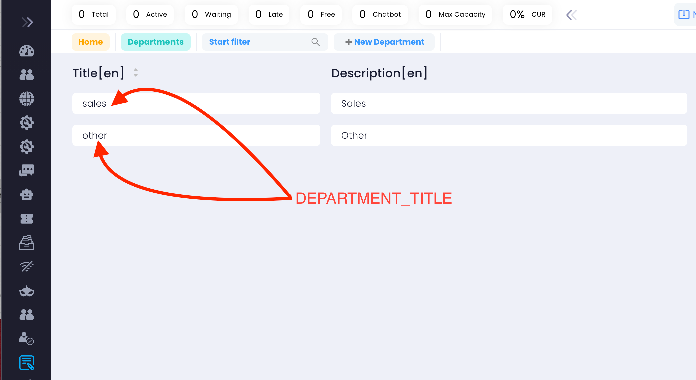
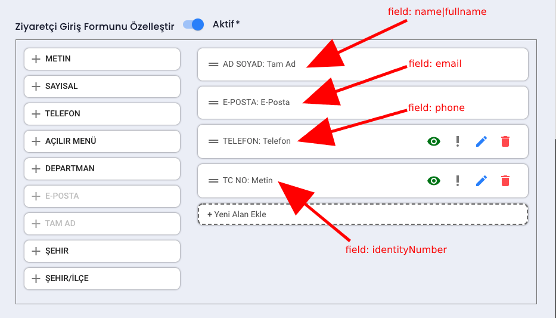
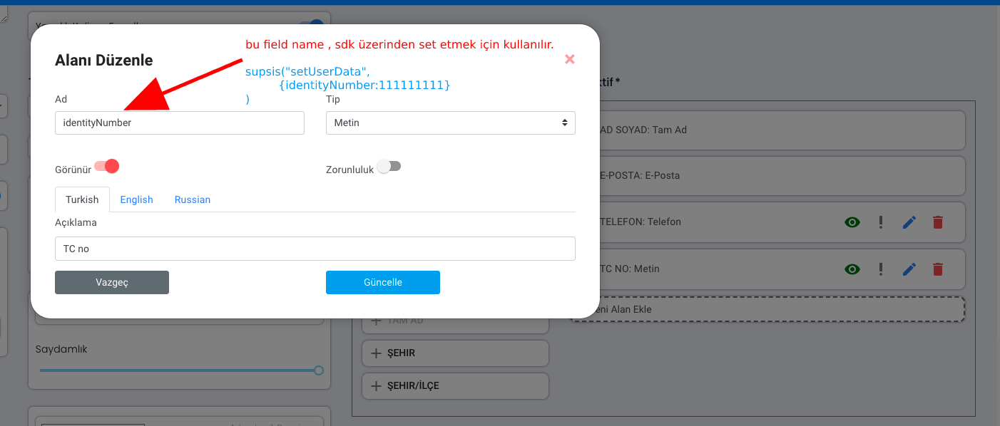
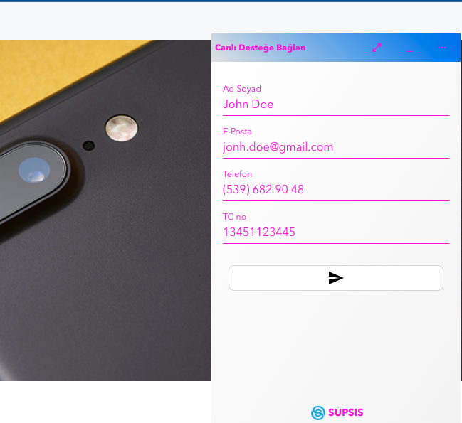
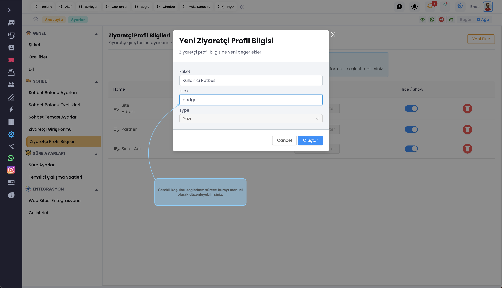
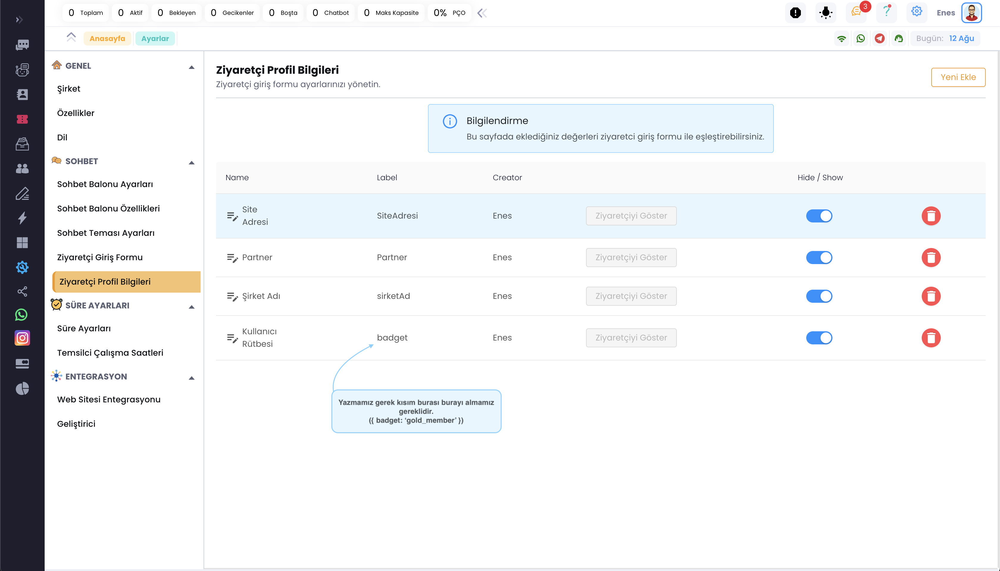

# SUPSIS JS SDK

*** 

## Entegrasyon

- Supsis Chat Balon'unu sitenize eklemek için aşağıda kodu siteniz her sayfanın tepesine eklemeniz gerekmektedir.

```
* SUPSIS SDK async olarak yüklenir ve site açılış hızınını etkilemez.
* Sadece chat balonu olmasını istediğiniz sayfalara ekleyebilirsiniz.
* Supsis SDK yüklenince ve app hazır olunca balon gözükecektir !!
```

## Entegrasyon Kodu

```js
<script>window.supsis=window.supsis||function(){(supsis.q = supsis.q || []).push(arguments)};supsis.l=+new
  Date;</script>
<script src="https://SITE_DOMAIN_ADINIZ.visitor.supsis.live/static/js/loader.js" type="text/javascript" async
        defer></script>
```

::: warning

- `SITE_DOMAIN_ADINIZ` yerine supsis'e kayıt olurken verdiğiniz domain adınız gelmelidir.
- IdeaSoft'tan geldiyseniz ideasoft domain adınız supsis domain adınız olacaktır.
- Örneğin market71.supsis.live üzerinden giriş yapıyorsanız SITE_DOMAIN_ADINIZ=market71 dir
  :::

## SYNC API

SYNC API supsis. kullanımı içindir. ASYNC API ise supsis() kullanımı içindir API methodları ASYNC altında
gösterilecektir.

| METHOD                                |                  SYNC API ile Kullanımı                   |                                 ASYNC API ile Kullanımı |
  |---------------------------------------|:---------------------------------------------------------:|--------------------------------------------------------:|
| Chat Ekranını Açma                    |                   ```supsis("open")```                    |                                    ```supsis("open")``` |
| Chat Balonunu Gizleme                 |                 ```supsis("minimize")```                  |                                ```supsis("minimize")``` |
| Chat Balonunu seçili sayfadan gizleme |                   ```supsis("hide")```                    |                                    ```supsis("hide")``` |
| Konuşmayı Sonlandırma                 |                 ```supsis("closeChat")```                 |                                   ```supsis("close")``` |
| User Datası Tanımlama                 | ```supsis("setUserData",{name:'Ali',email:'a@a.com'})```  | ```supsis.setUserData({name:'Ali',email:'a@a.com'}) ``` |
| User Contact Properties               | ```supsis("setContactProperty",{badget:'gold-member'})``` | ```supsis.setContactProperty({badget:'gold-member'})``` |

```js
supsis("ready", (supsis) => {
  //suspis'i bu alanda sync olarak kullanabilirsiniz

  supsis.open();
  supsis.setUserData({name: "Ali", email: "a@a.com"});
});
```

veya SDK sync olarak yükleyip kodunuz bu satırdan sonra çalıştırsanız da olabilir.

!! sync yüklemek site yüklenme hızınıza az bir overhead ekleeybilir.

```js
<script src="https://SITE_DOMAIN_ADINIZ.visitor.supsis.live/static/js/loader.js" type="text/javascript">
  supsis.open()
  supsis.setUserData({name:'Ali',email:'a@a.com'})

</script>
```

## ASYNC API

***
Supsis SDK async yüklendiği için api call kodlarınız yüklendikten sonra çalışacaktır. ASYNC API yapısı aşağıdaki
gibidir.

```js
supsis(API_FUNCTION_NAME, payload);
```

- "API_FUNCTION_NAME" string değerdir. çalıştırılacak fonksiyon ismini alır.
  - ```supsis.open() karşılığı ===> supsis("open");```
- Payload çağırdığınız fonksiyon parametre alıyorsa buradan girebilirsiniz.

## Chat Balonunu Gizleme

```js
supsis("minimize");
```

## Chat Ekranını Açma

```js
supsis("open");
```

## Konuşmayı Sonlandırma

```js
supsis("closeChat");
``` 

## Departman Değiştirme

```js
supsis("department", "$DEPARTMENT_TITLE");
```



- Department title değerleri tüm diller için aynı olmalıdır

## Ziyaretci Bilgilerini Değiştirme

Ziyaretcileriniz henüz chat balonuna tıklayıp destek almadan önce onun kişisel bilgileri supsis sdk'e önceden verirseniz
otomatik bilgiler set edilir. Sizin sistemizdeki ad soyad ve email bilgileri ile supsis destek üzerinden chat
başlatabilir.

Not: User data verilmezse Supsis Login Form üzerinden alınan bilgiler ile chat başlatılır.

<b>Default Login Form için Ziyaretci Bilgilerini Değiştirme</b>

## Default Login Form için Ziyaretci Bilgilerini Değiştirme

```js
supsis("setUserData", {
    name: "Sitenize Login Olan Kullanıcın Adı ve Soyadı",
    email: "Sitenize Login Olan Kullanıcın Eppst Adresi",
});
```

## Özelleştirilmiş Login Form için Ziyaretci Bilgilerini Değiştirme

- Özel Giriş Form'larında zorunlu alanlar (name,email)
- Diğer alanları(fields) istediğniz gibi genişletebilirsiniz. Her alana(field) bir isim vermeniz gerekmektedir bu alan
  isimleri ziyaretcileri bilgileri uzaktan değiştirmek için kullanacaksınız.

Örnek bir Özel Giriş Formu tasarlayalım ve şu alanları ekleyelim (name,email,phone,identityNumber)



***



```js
supsis("setUserData", {
  name: "John Doe",
  email: "jonh.doe@gmail.com",
  phone: "5396829048",
  identityNumber: "13451123445",
});
```

Yukarıdaki komutu çalıştırdığınızda login form dolu bir şekilde gelecektir.



## Özelleştirilmiş Kullanıcı Verisini Değiştirme (User Contact Properties)

- Panel üzerinden oluşturduğunuz Özelleştirilmiş Kullanıcı Verilerini değiştebilirsiniz
- Örnek olarak müşterilerinizden birisi canlı desteğe bağlandı ve onun hakkında daha detaylı bilgi almak istiyorsunuz
  işte Bu özellik sizin işinize yarayabilir.

## Örnek Adımlar

- Müşterinizin üyelik seviyesini öğrenmek istiyorsanız aşağıdaki adıma bakabilirsiniz.

Şimdi Kullanıcı Rütbesi adında bir etiket oluşturuyoruz ve Field olarak gelecek değeri yani isimi uygun koşulara uygun
şekilde güncelliyoruz.



***
- Oluşturduğumuz Kullanıcı Rütbesi adındaki etiketi müşterinize eklemek istiyoruz.
***



```js
supsis("ready", (supsis) => {
  // Supsis hazır olduğunda gelen eventi dinliyoruz.
  // member datası sizin websitesindeki datasını alıyorsunuz.
  const member = {
    badget: "gold_member",
    ...
  };
  supsis.setContactProperty({  badget: member.badget });
});
```


