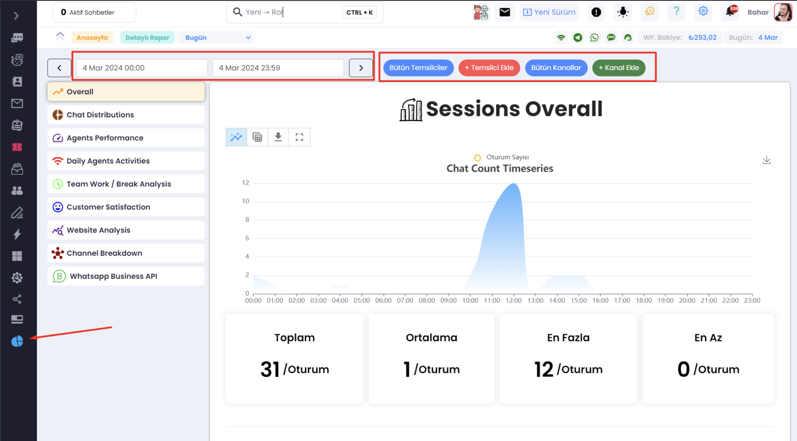
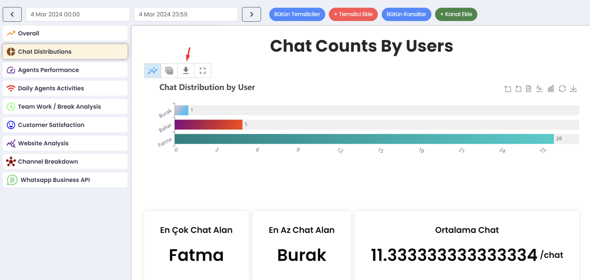
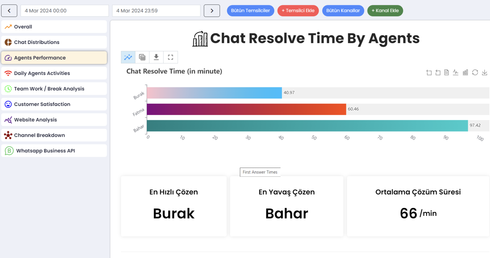
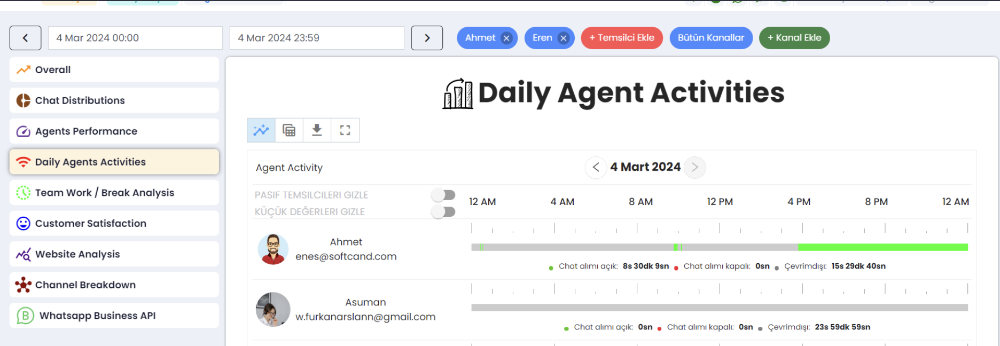
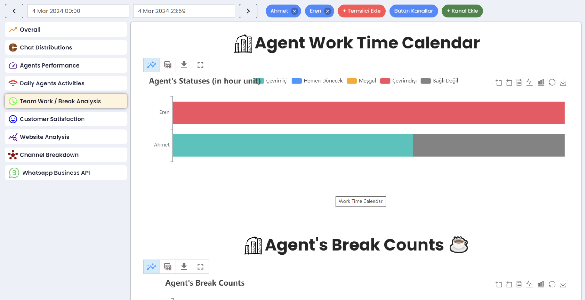
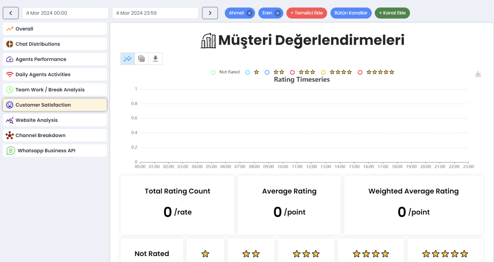
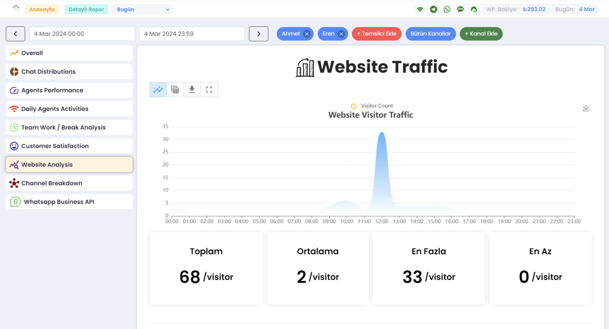
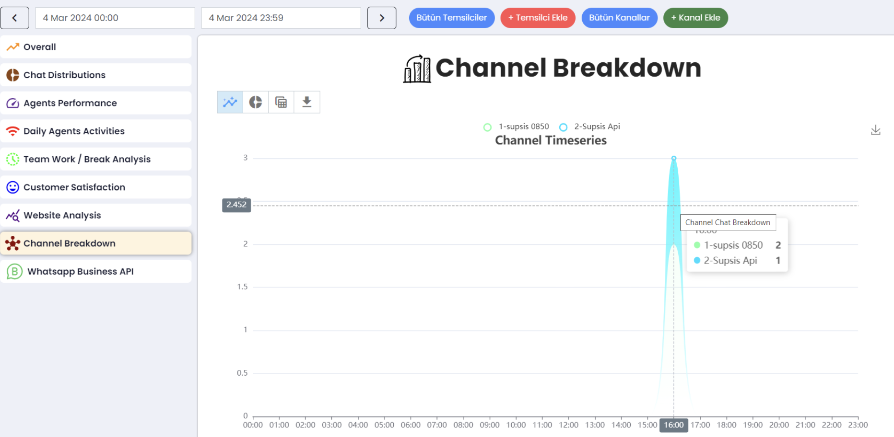
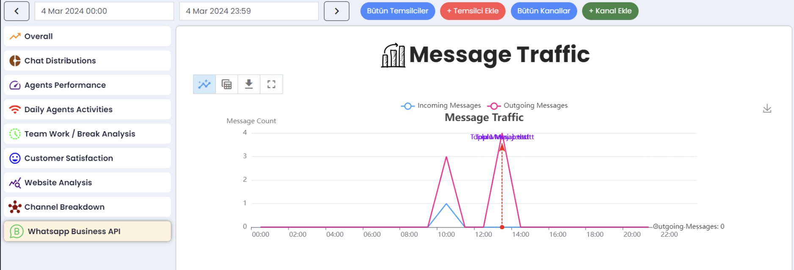

# Raporlar

<b>Raporlama:</b> destek hizmetleri ve personel çalışmalarının takip edilir raporlarda gösterimini sağlar ve kayıt
altına
alınıp kullanılabilir. Bu raporlar, işletmelerin müşterileri hakkında daha fazla bilgi edinmelerine yardımcı olur.
Raporlar, müşteri memnuniyeti, müşteri geri bildirimi, talep edilen konular, yanıt süresi, etkileşim sayısı gibi birçok
farklı özelliği içermektedir.

- Raporlama ekranına gelmek için sol alt kısımda bulunan <b>Raporlara</b> basalım.
- Sol tarafta rapor başlıkları bulunuyor. Görmek istediğinizin üstüne basarak o konu hakkında sağ tarafta çıkan grafik
  üzerinden bilgi sahibi olabilirsiniz. Üst kısımdan ise tarih değişikliği yapabilirsiniz.

*** 

- Tarih ayarlaması yaptıktan sonra görmek istediğiniz raportu seçiniz. Raporları indirebiliyorsunuz. İlk baştaki genel
  rapordur. İkinci sırada ise chat dağılımları mevcut. Kime ne kadar chat gitmiş kim ne kadar konuşmuş görebilirsiniz.

- Temsilcilerinizin performanslarını detaylı bir şekilde görebilirsiniz.

- Günlük temsilcilerinizin faaliyetlerinin raporunu görebilirsiniz.

- Takım Çalışması / Mola Analizi'nin detaylı raporunu görebilirsiniz.

- Müşteri değerlendirmelerini ve web site analizinin raporunu detaylıca görebilirsiniz.

***

Kanal dağılımlarını ve api kanalının hareketlerini, trafiğini görebilirsiniz.

***

***

Supsis görüldüğü gibi kullanımı bu kadar basit bir arayüze sahip. Eğer herhangi bir sorun yaşarsanız destek ekibimiz
sizinle her zaman iletişime geçebilir. Sizin sorununuzu çözmekten mutluluk duyarız. Çünkü kullanıcılarımız bizler için
çok önemli. Supsis web sitemize [burdan](https://www.supsis.com) ulaşabilir ve destek talep edebilirsiniz. 

