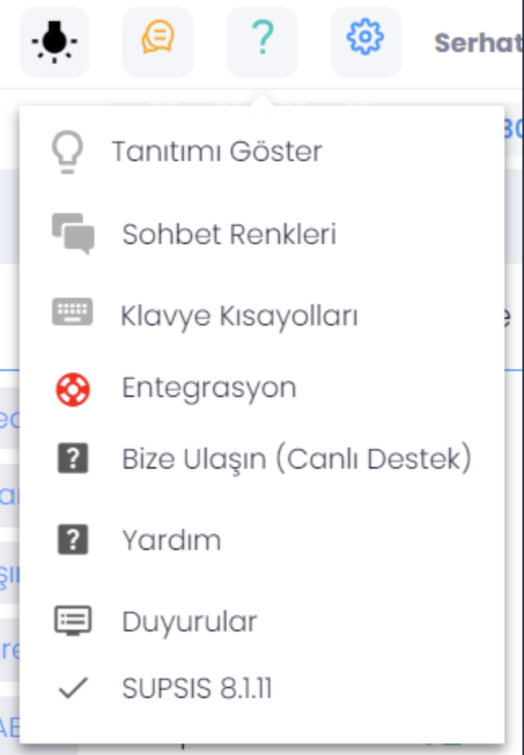

# Ayarlar çark

#### Dil Değiştirme

8 farklı dil seçeneği bulunmaktadır.

* 1.Türkçe: Varsayılan dil olarak kullanılmaktadır.
* 2.İngilizce: İngilizce dil paketini uygular.
  Ekran Büyütme Ayarı: Tarayıcıda 75 oranında uzaklaştırma 125 oranında yakınlaştırma sağlayarak göz konfor desteğini
  aktifleştirir.

#### Temsilci Ayarları

Temsilci ayarları hakkında "burdan" bilgi alabilirsiniz.

#### Ziyaretçi Ekranı

Misafir konuşma sayfasına geçiş imkanı sağlayarak hızlı çözüm sunar.

# Diğer Kısımlar
---

#### Yardım Butonu

Panel bilgilendirme sunumunu ve özellikleri içerir.

* Tanıtımı Göster
  Üst panel,butonlar ve menülerin açıklamasını sağlayıp gerçek zamanlı uzaktan hızlı eğitim ve öğretim sağlar.

#### Sohbet Renkleri

Konuşma paneli anlamları ve listesi olarak sıralanır.

 

* ** Konuşma Renk Anlamları **

* Konuşma gösterge Paneli: 5 renk seçeneği bildirimi mevcut olup, okunmamış, ziyaretçi çıkış aktif konuşma, otomatik
  atanmış, izleme modu gibi durumlarırenklendirir.
* Konuşma Listesi : 2 renk seçeneği bildirimi mevcut olup; temsilci bağlantısı kopmuş ve gecikmeye düşen konuşmaları
  renklendirir.

#### Gece Modu Seçim Butonu

Göz sağlığı ve konforu için düşünülüp tasarlanmış,
tecrübeleri sonrasında göz yorgunluğunun daha az olacağı tonlamalarda çalışmalarla
geliştirilmiştir.

#### Üst Sayaç Bilgi Paneli

**Toplam:** Birçok kanaldan gelebilecek sistemdeki aktif konuşma sayısını sağlar.
**Aktif:** Temsilcinin bireysel aktif konuşma sayısıdır.
**Bekleyen:** Temsilci ataması bekleyen yeni aktif konuşma sayısıdır.
**Gecikenler:** Belirli bir süre bekletilen ve temsilci atanamayan yeni konuşma sayısıdır.
**Boşta:** Beklenmeyen bir durumda temsilci çıkışı sonrası; yeni temsilci bekleyen konuşma sayısıdır.
**Maksimum Kapasite:** Sistemin bekletmeden temsilciye atanabilecek konuşma sayısıdır.
**PÇO:**Personel Çalışma Oranı demektir. Çevrimiçi temsilcilerin toplam
konuşma sayısının doluluk oranını sağlar.

* Üst Sayaç Bilgi Paneli Gizle: Çalışma sayfası özelleştirme sağlar.
* Bana Atananları Göster: Diğer temsilci konuşmalarının filtrelenip, kendi
  misafirlerinizin sıralanması.
* Temsilci Bekleyenleri Göster: Hiçbir temsilci ataması yapılmamış misafirleri sıralar.
* Ziyaretçiler: Gerçek zamanda canlı destek hizmeti alan misafirler listelenir.

 ---
** Supsis görüldüğü gibi kullanımı bu kadar basit bir arayüze sahip. Eğer herhangi bir sorun yaşarsanız destek ekibimiz
sizinle her zaman iletişime geçebilir. Sizin sorununuzu çözmekten mutluluk duyarız. Çünkü kullanıcılarımız bizler için
çok önemli. Supsis web sitemize [burdan ](http://supsis.com/) ulaşabilir ve destek talep edebilirsiniz. **

~[SoftCand Yazılım Hizmetleri Anonim Şirketi](https://softcand.com)~

