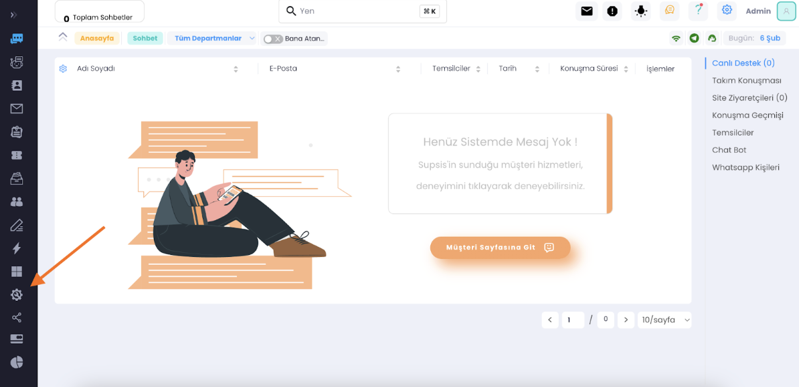
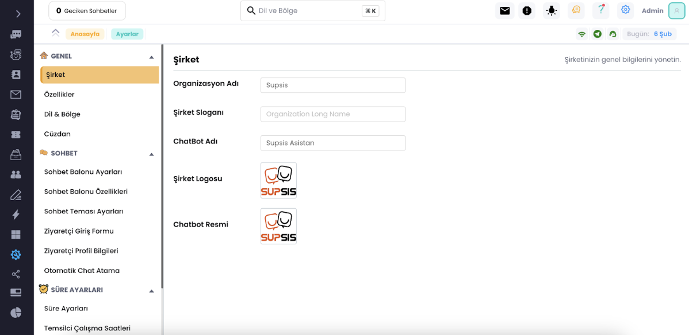
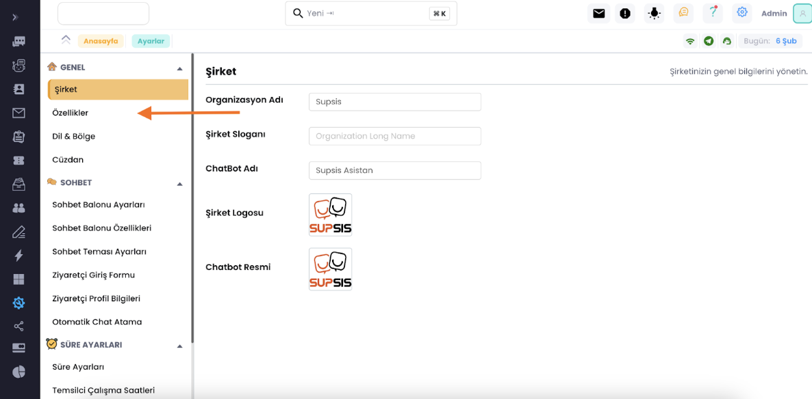
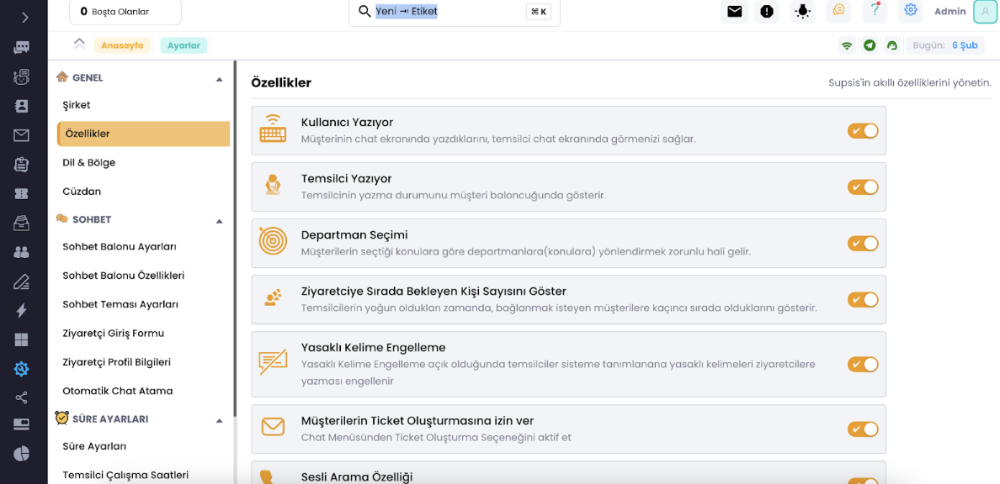
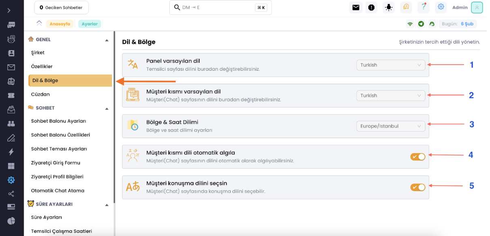

# Genel-Dil-Chat Süre ve Balon Ayarları

Aşağıdaki adımları takip ederek panelimizin ayarlar kısmına girelim.

Bu kısımda özelleştirmeleri kendinize göre ayarlarınız.

Gerekli özelleştirmeleri yaptıktan sonra özellikler bölümündeki ayarları da kendinize göre özelleştirin, hangi ayarın
neyle alakalı olduğu yan kısmında detaylıca yazıyor.

Özellikler Sırasıyla:

1. Panelde kullandığınız dili değiştrir.

2. Chat ekranının dilini değiştirir.

3. Saat dilimini bulunduğunuz ya da müşterilerinizin bulunduğu bölgeye göre ayarlayabilirsiniz.

4. Otomatik dil çeviri sistemini kullanabilmeniz için açık olması gereklidir, müşterinizin konuştuğu dili algılar.

5. Müşteri konuştuğu dili chat ekranından değiştirebilir.

