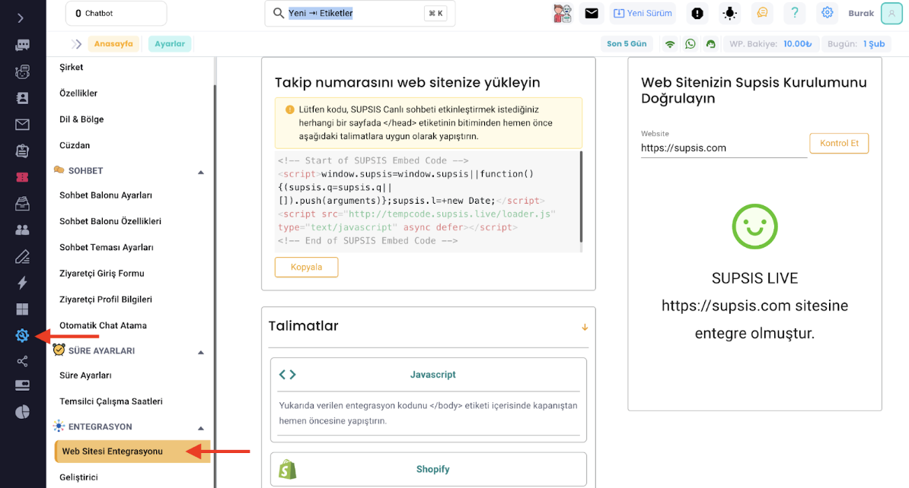
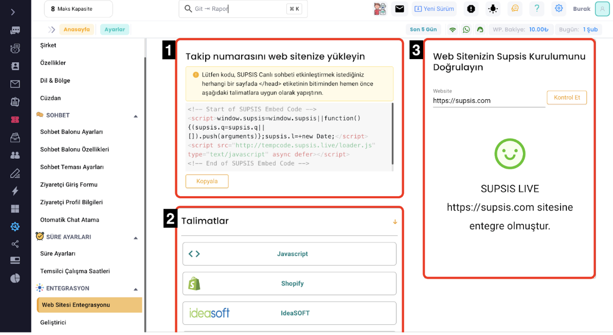

# Website Entegrasyonu

Supsis’i sitenize entegre etmek için size gereken Entegrasyon Kodu’na ilk girişte karşımıza çıkan Hızlı Kurulum
panelinde en son aşamada karşımıza çıkan ekranda ulaşabiliriz.

Ancak eğer bu kısmı kaçırdıysak veya kod tekrar lazım olduysa:

- Supsis içerisinde solda bulunan Yönlendirici Menü üzerinden <b>“Ayarlar”</b> sekmesine ve sonrasında ise <b>“Web
  Entegrasyonu”</b> alanına giderek hem kodumuzu tekrardan alabilir hem de entegrasyonu ile alakalı olan talimatları
  bulabiliriz.

- Bu alana girdiğimizde bizi 3 farklı işlevi olan 3 alan karşılar, bunlar görseldeki numaraları ile aşağıda
  anlatılmıştır:

1. Bu alanda sitemize eklememiz gereken kodu görebilir ve buton yardımı ile kopyalayabiliriz.

2. Bu alanda kopyalamış olduğumuz kodu hangi platforma göre nasıl kullanacağımıza dair yönlendirici talimatlar
   bulunmaktadır.

3. Bu alanda ise sitenizi yazarak entegrasyonunun başarılı bir şekilde tamamlanmış olduğunu doğrulamak için bir araç
   bulunmaktadır. Sitemizi yazdıktan ve “Kontrol Et” butonuna bastıktan sonra aşağı kısımda bize sonuç gösteren bir
   görsel ve yazı bulunmaktadır.

me 

