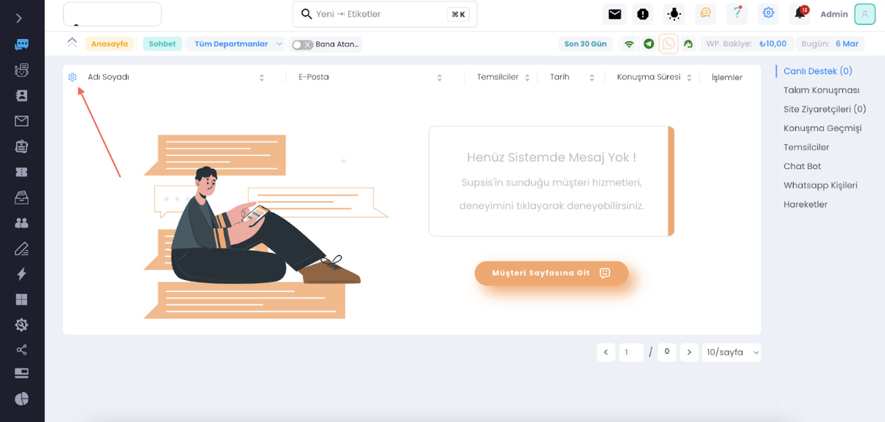
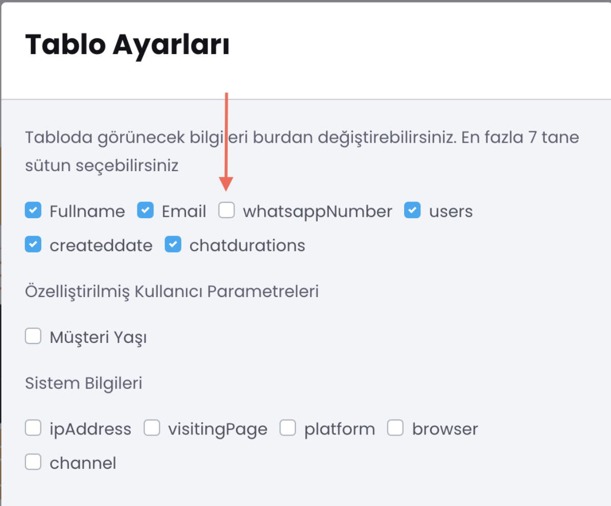

# Website Entegrasyonu

Supsis chat menüsündeki ziyaretçilerin görünen bilgilerini güncelleyebileceğinizi biliyor muydunuz?

Yukardaki görseldeki gözüken kısmlarını güncellemek için yapmanız gereken adımları aşağıda sizlerle paylaşıyorum.

*** 

Gözükmediğini istediğiniz kutucukları tikleyerek istediğiniz bilgilerin chat ekranında gözükmesini sağlayabilirsiniz.
