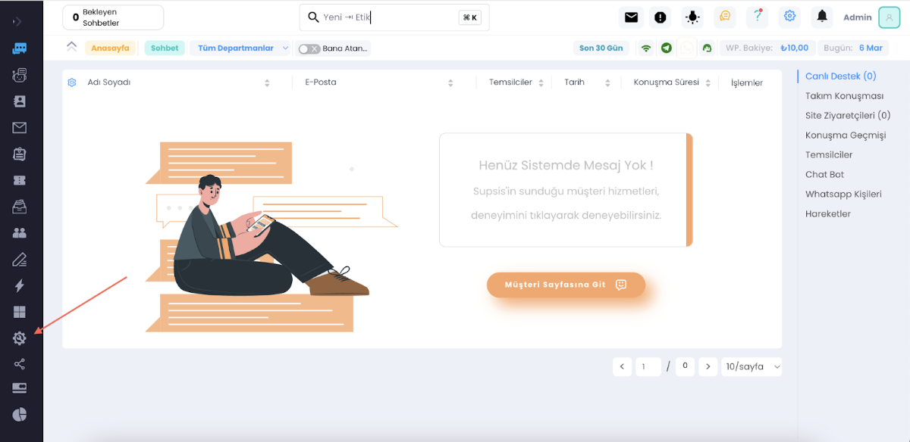
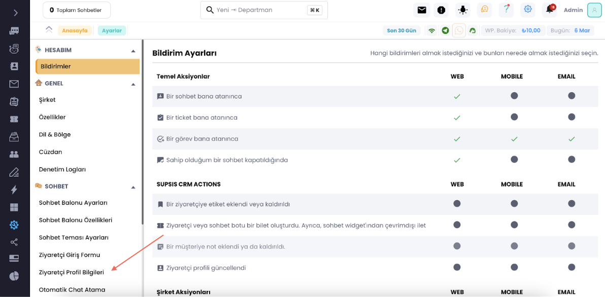
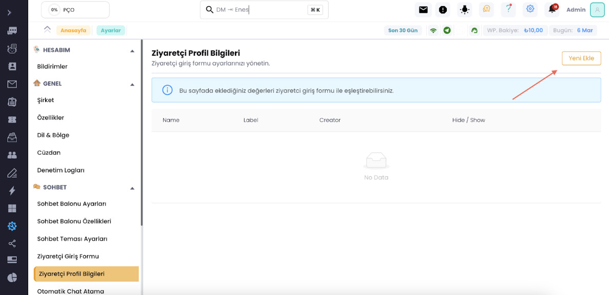

# Ziyaretçi Profil Bilgisi Ekleme

Aşağıdaki adımları takip ederek müşterilerinizden toplayacağınız dataları, soru bloglarında yanıtı kaydetlerin hangi
isimle kaydedileceğini, chatbottaki özellik ayarla kısımlarının içerisine ne yazılacağı gibi konular için ziyaretçi
profil bilgisi ekleyebilirsiniz. Eklediğiniz yanıtlar Türkçe karakter ve boşluk içermemelidir.

***

***

