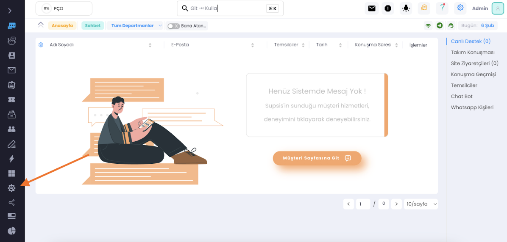
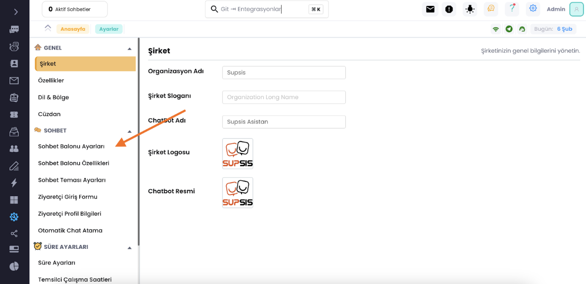
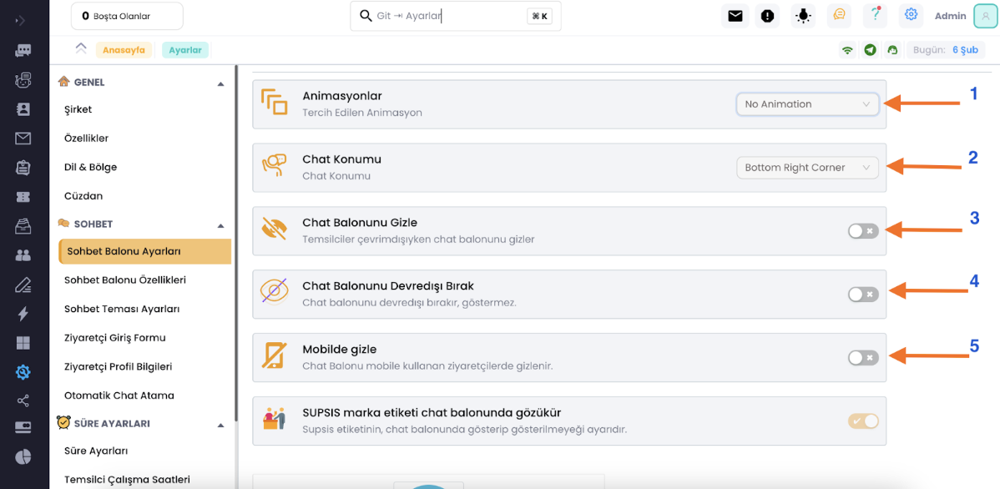
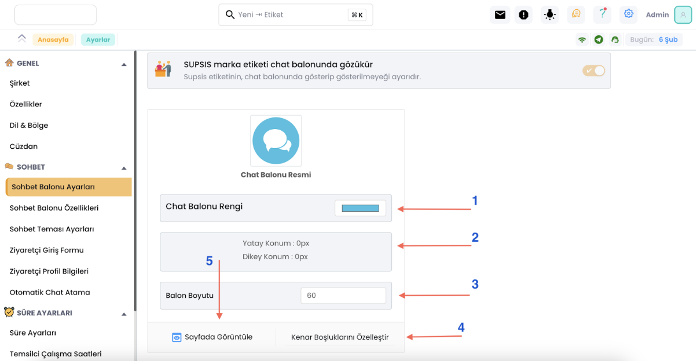
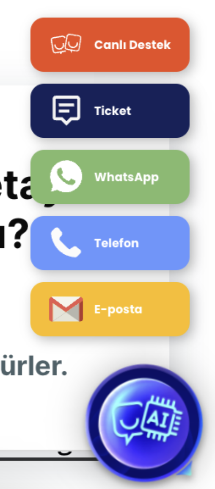
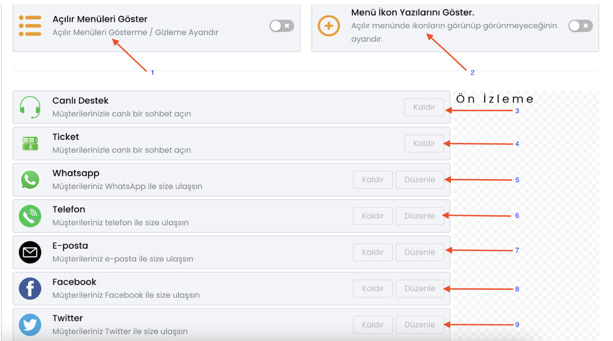
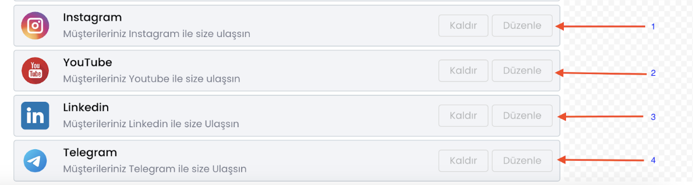

# Chat Balonu ve Açılır Menü Ayarlamaları

Sohbet balonunuzun özelliklerini ayarlamanız için aşağıdaki adımları takip ediniz.

***

*** 

***

<b>Ayarlamalar sırasıyla:</b>

1. Chat balonunun açılırkenki animasyon ayarlamasını yapabilirsiniz.

2. Chat balonunun yer ayarlamasını yapabilirsiniz.

3. Çevrimiçi temsilciniz yokken chat balonunu gizler.

4. Chat balonunu kapatıp açabilirsiniz.

5. Sitenizi mobilden ziyaret eden ziyaretçiler için chat balonunu gizler.

Aşağıdaki kısımda chat balonunuzun görünümünü nasıl özelleştirebileceğinizi göstereceğim, yine sohbet balonu ayarları
menüsünden bu özelleştirmeleri yapabilirsiniz.

<b>Sırasıyla:</b>

1. Chat balonunun rengini ayarlayabilirsiniz.

2. Chat balonunun yatay ve dikey konumunu ayarlayabilirsiniz.

3. Chat balonunun büyüklüğünü ayarlayabilirsiniz.

4. Kenar boşluklarının konumunu özelleşetirebilirsiniz.

5. Özelleştirdiğiniz chat balonunun websitenizde nasıl görüneceğini test edebilirsiniz.

Şimdi de chat balonunun açılır penceresini özelleştirelim ilk önce açılır pencerenin nasıl çalıştığını anlamanız için
size açılır pencere örneği göstereyim.

Açılır pencere birden çok kanalınızı bağlayabileceğiniz müşterinizin size ulaşmak istediği kanaldan ulaşmasını
sağlayabileceğiniz sistemimizdir. Hadi nasıl özelleştirebileceğinizi göstereyim.

Okla gösterilen kısma giriniz.

<b>Sırasıyla:</b>

1. Açılır menüyü aktif edebilirsiniz veya kapatabilirsiniz.

2. Aktif ederseniz açılır menüde bağladığınız kanalın adı ve ikonu gözükür, kapatırsanız sadece ikon gözükür.

3. Müşterilerin canlı destek sistemiyle etkileşime geçebilmesini sağlar.

4. Müşterilerin size ticket bırakbilmesini sağlar.

5. Müşterilerin sizinle WhatsApp kanalından iletişime geçebilmesini sağlar.

6. Müşterilerinizin sizin telefon numaranıza tek tıkla erişebilmesini sağlar.

7. Müşterilerin sizinle E-posta kanalından iletişime geçebilmesini sağlar.

8. Müşterilerin sizinle Facebook kanalından iletişime geçebilmesini sağlar.

9. Müşterilerin sizinle Twitter (X) kanalından iletişime geçebilmesini sağlar.

1. Müşterilierin sizinle Instagram kanalından iletişime geçebilmesini ve Instagram hesabınıza erişebilmesini sağlar.

2. Müşterilerin sizin YouTube kanalınıza ulaşabilmesini sağlar.

3. Müşterilerin sizinle LinkedIn kanalından iletişime geçebilmesini ve hesabınıza erişebilmesini sağlar.

4. Müşterilerin sizinle Telegram kanalından iletişime geçebilmesini sağlar.

