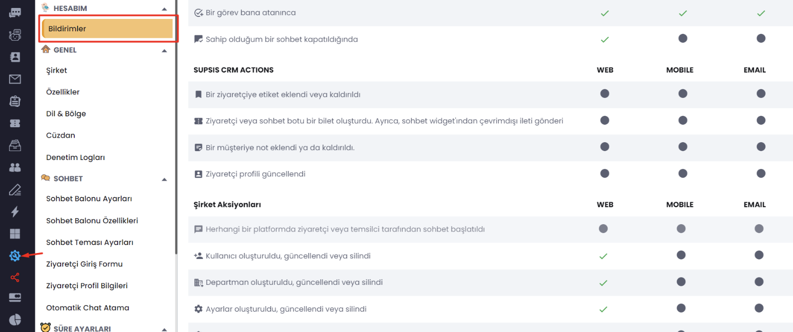

# Bildirim Ayarları

- Genel olarak almak istediğiniz tüm bildirimleri belirlemek isterseniz aşağıdaki fotoğrafta da gösterildiği gibi <b>"
  Ayarlar"</b> kısmına girelim.

- Daha sonra ise en üstte bulunan "Hesabım" kısmının altındaki "Bildirimler"e girelim. Burada tüm bildirimleri detaylı
  olarak görebilirsiniz. Dilediğinizi aktif ya da pasif hale getirebilirsiniz. İsteğinize göre mobilden bildirim alıp
  masaüstünde almama gibi seçenekleriniz mevcut.

- Bildirim geldiği zaman masaüstünde fotoğraftaki gibi gözükecektir.

***

# Temsilci Bildirim Sesleri

Buradan ise bildirimlerin türlerine göre özel ses ayarlaması yapabilirsiniz. Ses değişikliği yapabilir, bildirim sesini
kısabilir ya da arttırabilirsiniz. Bu özellik sizler için çok önemli çünkü farklı bildirim seslerini farklı durumlara
koyarak size bildirim sesine göre daha kolay ayırt etmenizi sağlayacaktır. Mesela bir müşteri siteyi ziyaret etti ona
koyduğunzu bildirim sesiyle, canlı desteğe bağlanan ziyaretçinin bildirim sesi farklı olursa daha iyi anlarsınız. Şimdi
ise nasıl ayarlanabildiğine geçelim.

- Öncelikle sağ üstte bulunan resmimizin üstüne basalım

- Daha sonra ordan temsilci ayarlarına basalım.

- Açılan pencereden tüm ayarlamaları yapabilirsiniz.

Yeni ziyaretçi: Web sitenize gelen ziyaretçiler için bildirim ayarı.

- <b>Yeni Chat:</b> Sisteme gelen her yeni chat için bildirim geliyor.
- <b>Atanan Chat:</b> Size atanan her yeni chat için bildirim ayarı.
- <b>Yeni Chat:</b> Size atanmış olan chat için bildirim ayarı.
- <b>Özel Mesaj:</b> Takım konuşmasından gelen mesajlar için bildirim ayarı.
- <b>Yeni Ticket:</b> Ticket için bildirim ayarı.
- <b>Yeni Duyuru:</b> Gelen duyuru mesajları için bildirim ayarı.

- Bildirimleri manuel olarak hangi bildirim sesini istiyorsanız açabilir ya da kapatabilirsiniz.

# Temsilci Ayarları

***

Temsilci ayalarlarından bildirim sesi düzeyi belirleyebilir, bildirimleri kapatabilir veya açabilir, kullanıcı adı
değişikliği - şifre değişikliği yapabilirsiniz ve aktiflik durumunu belirtebilirsiniz. Panelimizin sağ üst tarafından bu
isteklerinizi kolaylıkla yerine getirebilirsiniz.

- Dikkat! Eğer bildirimler ile ilgili sorun yaşıyorsanız, tarayıcınızın adres çubuğundan <b>(Resimde Gösterilen)</b>
  kilit
  iconuna tıklayıp <b>"Site Ayarları"</b> alanından tıklayarak, açılan bölümden <b>"Ses"</b> izin ver olarak
  değiştirebilirsiniz.

<b>Aşağıdaki video size yardımcı olabilir.</b>

<video width="100%" height="auto" controls>
  <source src="https://static.supsis.live/common/doc.supsis.live/temsilciayarları.mp4" type="video/mp4">
</video>

