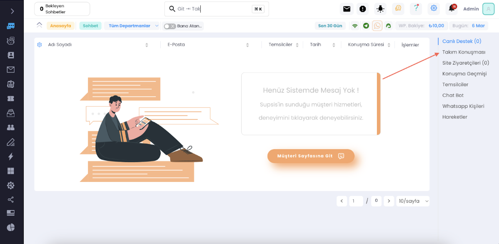
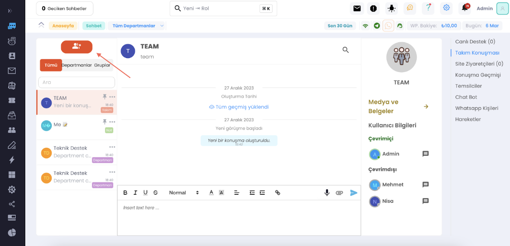
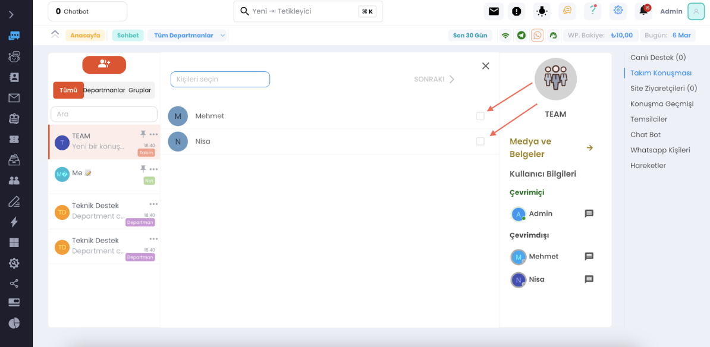

# Takım Konuşmasının Rolü

Canlı destek yazılımlarındaki takım konuşması özelliği, ekip üyelerinin birbirleriyle gerçek zamanlı olarak iletişim
kurmalarını sağlar. Bu, özellikle karmaşık sorunların çözümü veya birden fazla departmanı ilgilendiren konularda
işbirliği yapılması gerektiğinde kritik önem taşır. Takım konuşması sayesinde, ekip üyeleri:

- Müşteri sorularına hızlı ve tutarlı yanıtlar verebilir.
- Bilgi paylaşımını kolaylaştırır ve ekip içi öğrenmeyi teşvik eder.
- Çalışan memnuniyetini ve motivasyonunu artırır.
- Operasyonel verimliliği artırarak, müşteri sorunlarının daha hızlı çözülmesine olanak tanır.

Gelelim Takım konuşmasında ne gibi özelleştirmeler yapabileceğinize, adımları takip ederek panelimizin takım konuşması
menüsüne giriş yapalım.

***

*** 

Tikleri aktif edip sonraki butonuna basarak grup oluşturabilirsiniz, oluşturduğunuz departmanlar için otomatik grup
oluşacaktır.