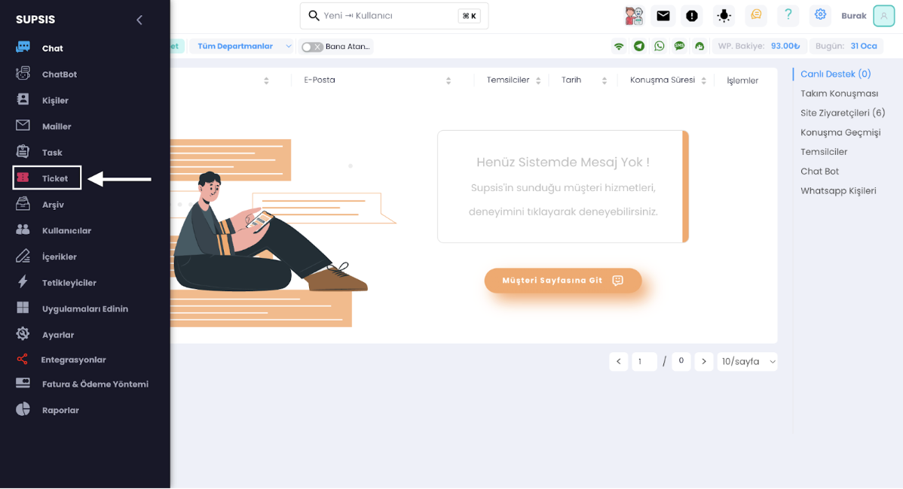
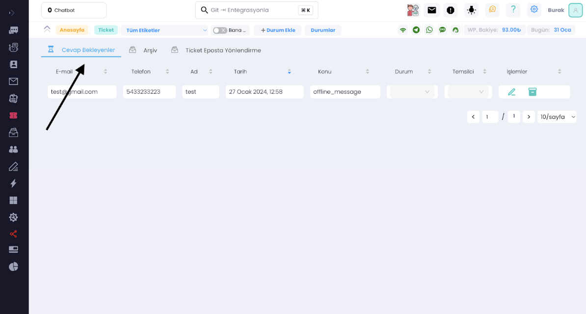
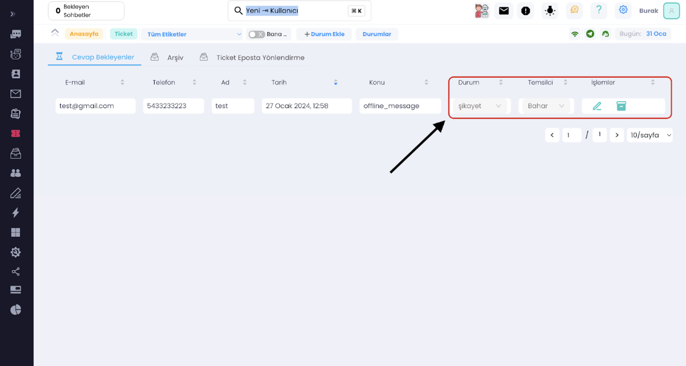
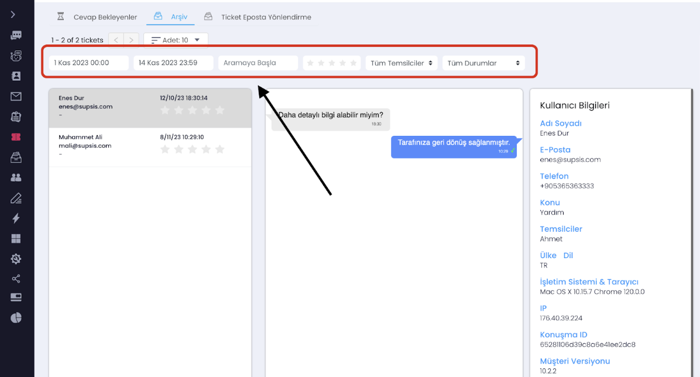

# Ticket Nasıl Kullanılır?

- Panelimizin solunda bulunan gezinme menümüzde <b>"Ticket"</b> kısmına tıklayalım.
  Bu ikonun kırmızı olması cevaplanmayan ticket olduğunu gösterir.

- Bu kısımda müşterilerden gelen ve henüz ceplanmayan ticketler bulunur. Temsilciler cevap vermek için bu alanı
  kullanır. Böylelikle ekip içindeki iletişim sağlığı korunmuş olacaktır.

- Her bir ticket için ise o satırda <b>"Durum"</b> ve <b>"Temsilci"</b> belirtilebilir, işlemler kolonu sayesinde ise
  ilgili ticket işaretlenebilir ya da arşivlenebilir.

- Okla gösterilen <b>“Arşiv”</b> sekmesini kullanarak cevaplanan veya arşivlenen ticketleri görüntüleyebiliriz. Burada
  kutucuk içerisinde bulunan filtrelemeler sayesinde <b>tarih aralığına, kelimeye, puanlandırmaya göre veya az önceki
  ekranda eklediğimiz durum ve temsilciye</b> göre filtreleyerek arayabiliriz.

