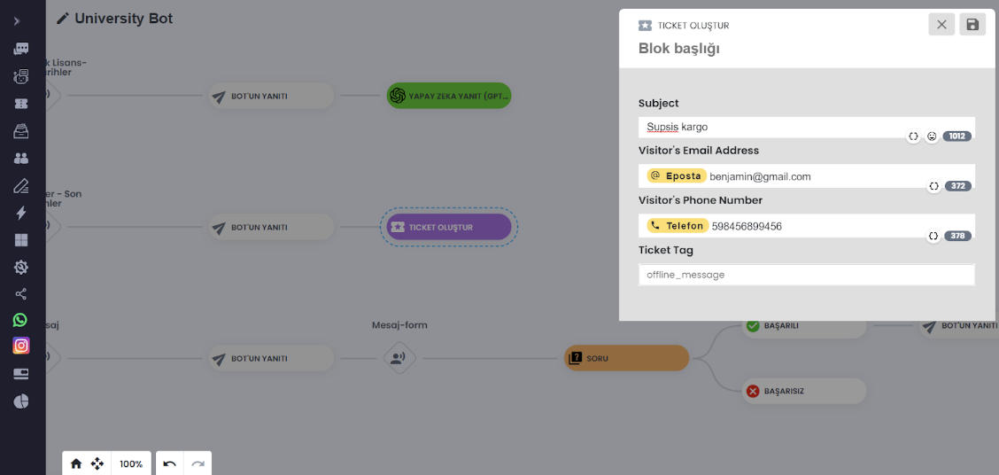
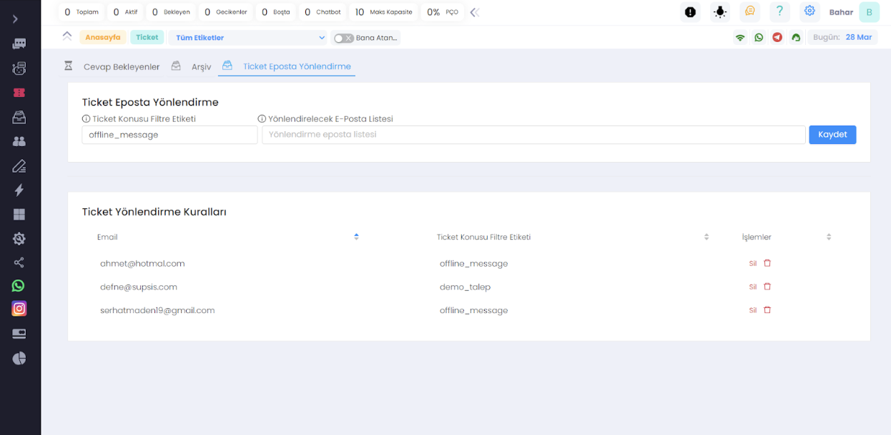

# ChatBot üzerinden Ticket Açma adımı eklenmesi

***

- Chatbot tasarım ekranında herhangi bir adıma tıkladığınızda sağdaki tasarım paneli açılır.

- Tasarım panelinde <b>"Ticket Adımı"</b> seçeneğini ekleyebilirsiniz. Bu adımda, ziyaretçilerden gelen talepleri
  yönetmek için
  bir sistem oluşturulur.

- Ticket Adımı'nı ekledikten sonra, <b>"Konu"</b> alanı, Ticket Konu Etiket Filtresi için kullanılır ve ziyaretçilere
  gösterilmez. <b>(Demo olarak "offline_message" etiketi girilebilir.)</b> Bu şekilde, ziyaretçiler offline olduğunda
  bile
  bıraktıkları mesajlar sistemde bir ticket olarak kaydedilir.

- <b>"Talep alındı"</b> gibi bir mesaj, ticket açıldıktan sonra ziyaretçiye geri bildirim sağlamak için chatbot
  tarafından otomatik olarak iletilir.

- Ayrıca, ticket'ı yönlendirmek için bir mail adresi belirlenerek, talepler temsilcilere yönlendirilebilir.

# Ticket Yönlendirme Kuralı Eklenmesi

***

- Menüden ticket sayfasına giriş yapınız ve "Ticket E Posta Yönlendirme" sekmesine geçiniz.

- Yeni Kural Ekleme Formu içinde "Ticket Konusu Filtre Etiketi" kısmında chatbot da tanımlı etiketleri seçebilirsiniz.

- <b>** '*' **</b> etiketi yeni açılan tüm ticketları ayırt etmeksizin belirttiğiniz e posta listesine bildirim atar.

- Listede gözüken etiketler chatbot tasarımda tüm adımlarınızda kullandığınız "ticket" bölümündeki topicleri toplar.

- Bu listede olmayan bir etiket de girebilirsiniz fakat ticketları sadece chatbot açtığı için chatbot da tanımlı olmayan
  etiket ticket bilgilerinde gelmez.

- Listeden yukarıdaki chatbot'a eklediğimiz <b>TICKET_TOPIC_FOO_BAR</b> etiketini seçelim.

- Email listesine tıkladığımızda açılan listede sistemdeki temsilciler gözükür bunlardan bir veya daha fazla
  seçebilirsiniz. Sistemde olmayan bir e posta adresini de yazarak ekleyebilirsiniz.

- Bilgileri girdikten sonra kaydete basınca verdiğiniz e posta/lar için ticket yönlendirme kuralının tanımlandığını
  aşağıdaki listede göreceksiniz.

