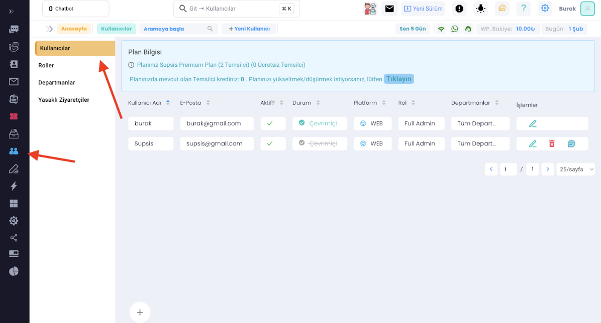
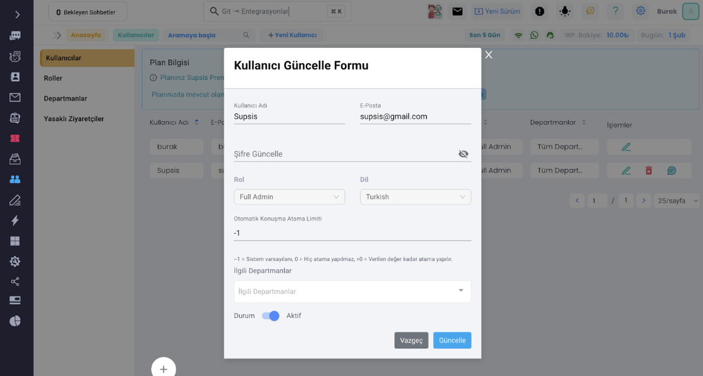
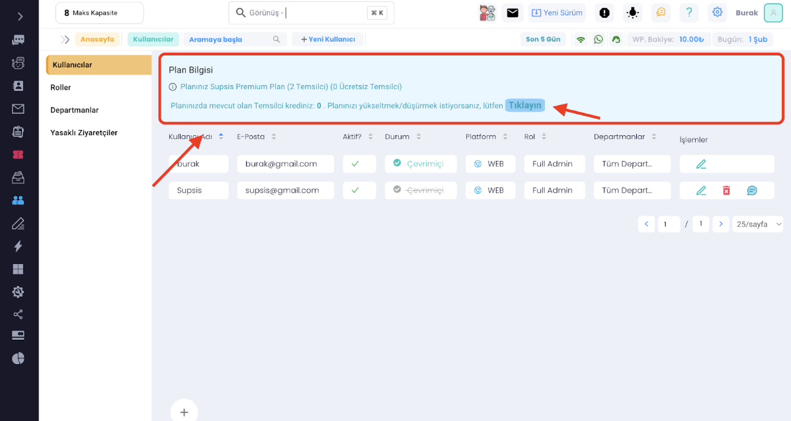
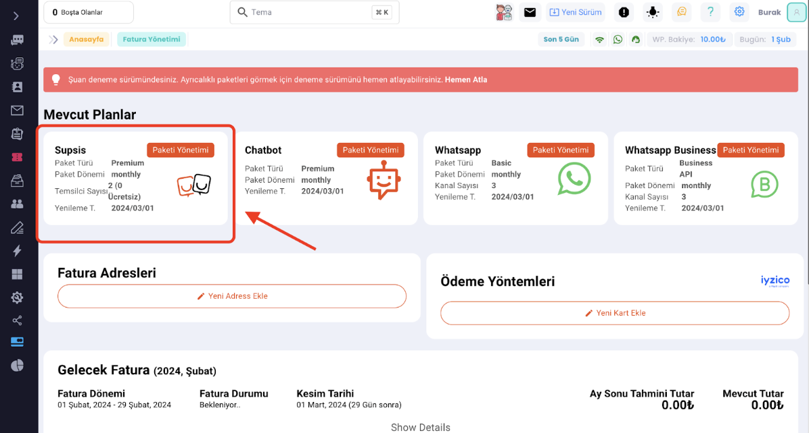
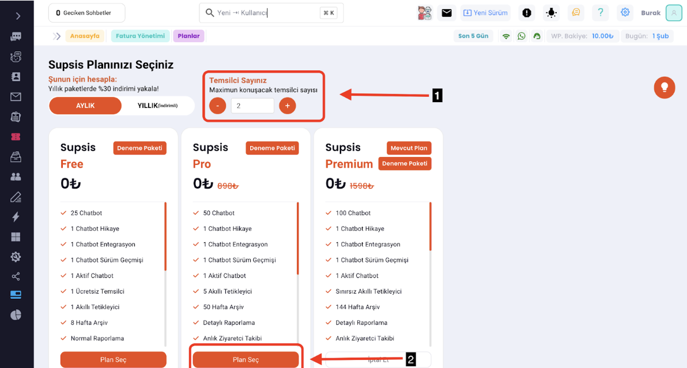
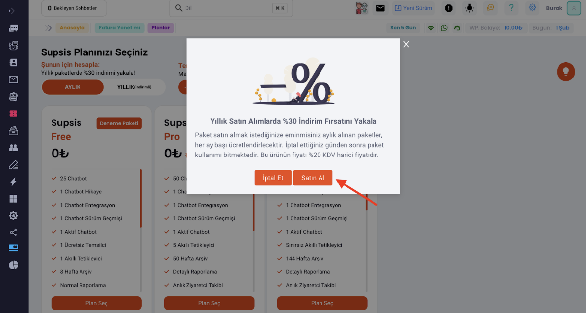

# Kullanıcılar

***

Temsilci oluşturulması ve görevlendirilmelerinin sağlanması, sistemdeki karmaşıklığı azaltarak basit ve anlaşılır
işlemleri kolaylaştırır.

Kullanıcılar panelinden tüm kullanıcılarınızı ve temsilcilerinizi görebilirsiniz. Bu panel, kullanıcıların durumlarını,
departmanlarını, rollerini ve bulundukları platformları detaylı bir şekilde görüntülemenizi sağlar. Bu bilgilerin
erişilebilir olması, birçok fayda sağlayabilir. İşte bazı örnekler:

1. <b>Performans İzleme:</b> Panel üzerinden kullanıcıların aktiflik durumlarını izleyebilirsiniz. Bu, hangi
   kullanıcıların ne
   kadar etkili olduğunu ve hangi kullanıcıların daha fazla desteğe ihtiyacı olduğunu anlamanıza yardımcı olabilir. Bu
   bilgileri kullanarak, departman performansını değerlendirebilir ve gerekli iyileştirmeleri yapabilirsiniz.

2. <b>Daha İyi Yönetim:</b> Panel üzerinden kullanıcıların departmanlarını ve görevlerini görüntüleyebilirsiniz. Bu,
   personelin
   görevlerini daha iyi yönetmenize ve her kullanıcının doğru departmanda çalışmasını sağlamanıza yardımcı olabilir.

3. <b>Verimlilik Artışı:</b> Panel üzerinden kullanıcıların aktiflik durumlarını izleyerek, hangi departmanların daha
   yoğun olduğunu ve hangi departmanların daha az yoğun olduğunu belirleyebilirsiniz. Bu, iş yükünü daha iyi yönetmenize
   ve personel verimliliğini artırmanıza yardımcı olabilir.

4. <b>Müşteri Memnuniyeti:</b> Panel üzerinden kullanıcıların aktiflik durumlarını ve departmanlarını izleyerek,
   ziyaretçilerin
   sorularına daha hızlı yanıt vermenize ve daha iyi hizmet sunmanıza yardımcı olabilir. Bu da müşteri memnuniyetini
   artırabilir ve işletmenizin itibarını koruyabilir.

Bu nedenle, canlı destek sistemleri için böyle bir panelin önemi büyüktür. Bu panel, işletmenizin performansını
izlemenize, personeli daha iyi yönetmenize, verimliliği artırmanıza ve müşteri memnuniyetini artırmanıza yardımcı
olabilir.

Şimdi, bu panelin nasıl kullanıldığına geçelim:

- Öncelikle sol kısımda bulunan kısımdan "Kullanıcılar" paneline girelim. Daha sonra karşımıza çıkan kısımda "
  Kullanıcıları" seçelim. Bu kısımda kullanıcılar liste olarak

- Bu alanda, temsilcilerinizin bir listesini görebilirsiniz. Kullanıcı adı, e-posta adresi, durumu, bağlı olduğu
  platform, rolü ve departman bilgileri gibi temel bilgileri burada görüntüleyebilirsiniz.

Ayrıca, sağ tarafta bulunan işlemler bölümünde bulunan butonlar sayesinde çeşitli işlemler gerçekleştirebilirsiniz:

1. <b>Düzenleme:</b> Temsilciyle ilgili bilgileri düzenleyebilirsiniz.
2. <b>Silme:</b> Temsilciyi sistemden silebilirsiniz.
3. <b>Konuşma Başlatma:</b> Direkt olarak temsilciyle iletişime geçmek için bu seçeneği kullanabilirsiniz.

# Kullanıcı düzenleme ekranı

***

Bu kısımda temsilcinin Adını, e-posta adresini değiştirebilir, şifresini güncelleyebiliriz.
Ayrıca temsilcinin Rolünü, dilini, departmanını ve otomatik atama limitini de burada düzenleyebiliriz.

# Plan Seçme ( Yükseltme / Düşürme )

***

Bir plan seçmek, kullanıcılara ve departmanlara izin verilen sayıya göre fiyatlandırma yapmanızı sağlar. Eğer planınızda
belirtilen kullanıcı ve departman sınırını aşarsanız, daha yüksek bir plana geçiş yapmanız gerekebilir. Supsis,
kullanıcıların ihtiyaçlarına göre farklı planlar sunar. Bu şekilde, herkes bütçesine uygun bir plan bulabilir ve
ihtiyaçlarına göre esneklik sağlanmış olur.

- Öncelikle kullanıcılar alanında bulunan Plan Bilgisi’nden, plan seçimine gidelim.
  Bu uyarı sınır sayıda temsilciye ulaştığınızda belirir.

- İşaretli alana tıklayarak temsilci sayılarımızı değiştirebildiğimiz detay ekranına gelelim.

- Ok ile işaretli olan alanda temsilci sayımızı değiştirebiliriz. Sonrasında bize uygun olan planı bularak <b>“Plan
  Seç”</b>
  butonuna tıklamalıyız.

- Planımızı seçtikten sonra önümüze gelen alanda bize yıllık alım avantajlarından ve paket iptali gibi konulardan
  bahsedilir. Burada da “Satın Al” butonuna tıklayarak temsilci sayısı değiştirme işlemimizi tamamlamış oluruz.

