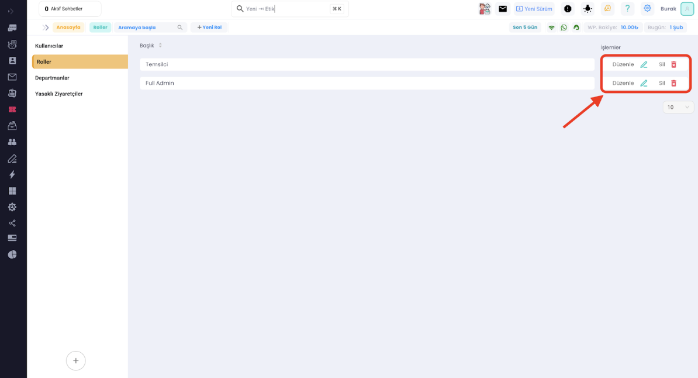
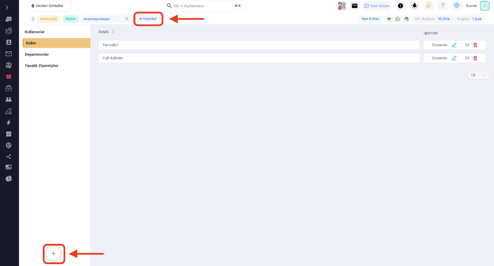
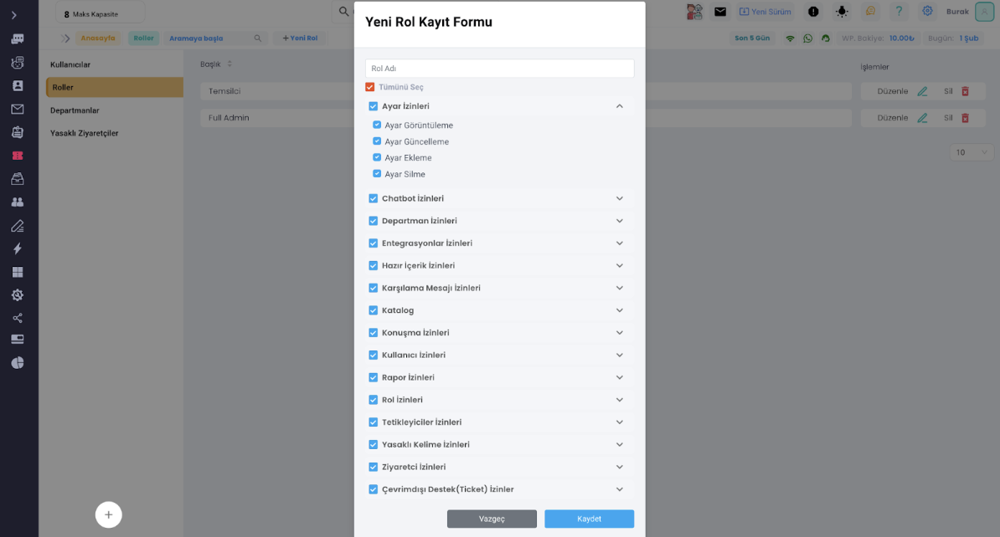

# Kullanıcı Rolleri

***

Supsis'te rol yönetimi özelliği bulunmaktadır. Bu özellik, canlı destek ekibindeki her bir personelin belirli yetkilere
sahip olmasını sağlar.

Rol yönetimi özelliği, canlı destek ekibindeki farklı roller ve yetkilerin belirlenmesini sağlar. Bu sayede, canlı
destek ekibi daha verimli bir şekilde çalışabilir ve iş yükünü daha iyi yönetebilir. Yönetici veya ekip lideri, belirli
bir personelin yetkilerini değiştirebilir veya yeni roller oluşturarak ekibe yeni yetkiler verebilir.

- Supsis Canlı Destek Sistemi'nde rol yönetimi özelliğini kullanmak için, yönetim panelindeki "Kullanıcılar" bölümünde
  bulunan "Roller" sekmesine tıklamanız yeterlidir. Bu sekmede, mevcut rolleri listeleyebilir, düzenleyebilir ve yeni
  roller oluşturabiliriz.
  

- Bu kısımda oluşan roller bulunur. Full admin rolü varsayılan olarak gelir ve tüm işlemlere yetkisi vardır. Bu alanda
  rol listesinde sağ tarafta bulunan işlemler kısmında <b>“Düzenle”</b> butonu ile ilgili rol üzerinde isim ve erişim
  değişiklikleri yapılabilir.
  Ayrıca <b>“Sil”</b> butonu ile rol tamamen silinebilir

- Eğer yeni bir rol eklemek istersek o zaman alt kısımdaki yuvarlak <b>“+”</b> butonuna ya da üst kısımda bulunan <b>
  “Yeni Rol”</b> butonuna tıklayarak yapabiliriz.

- Burada karşımıza gelen form aynı zamanda düzenleme kısmında olan form ile aynıdır. Bu kısımda isim verebilir, hangi
  işlem grubuna yetkisi olduğunu belirleyebiliriz. Ayrıca grupların yanlarında bulunan ikonlara tıklayarak tümden bir
  gruba yetki vermek yerine sadece görüntüleme, sadece düzenleme gibi daha ince ayarlar da yapabiliriz.

