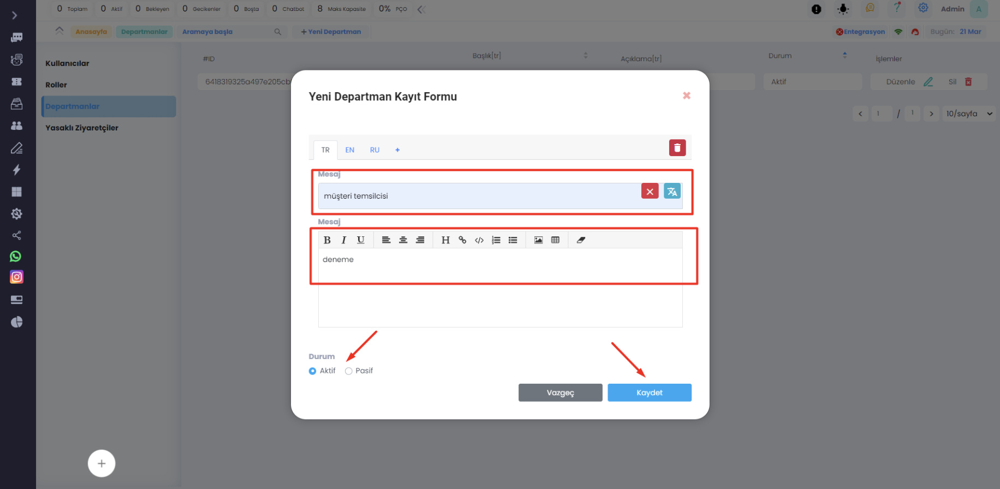
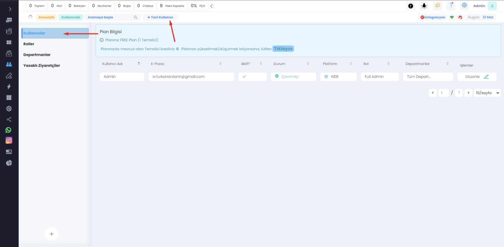
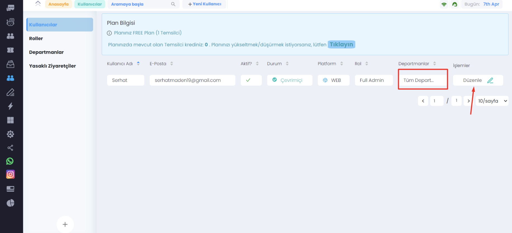
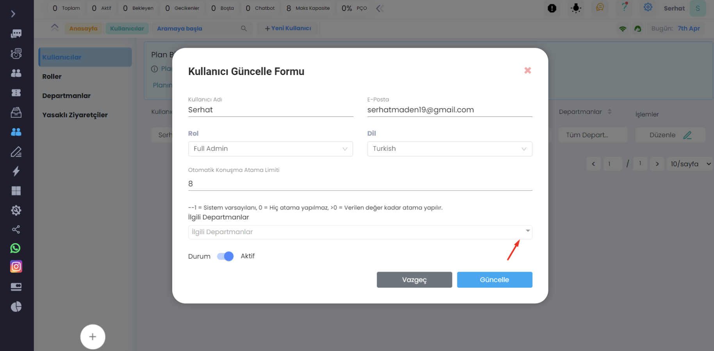
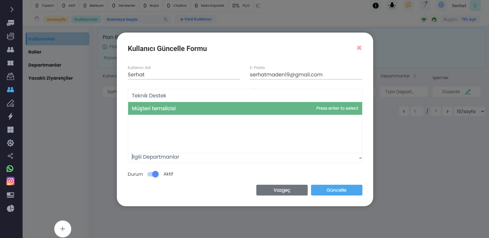
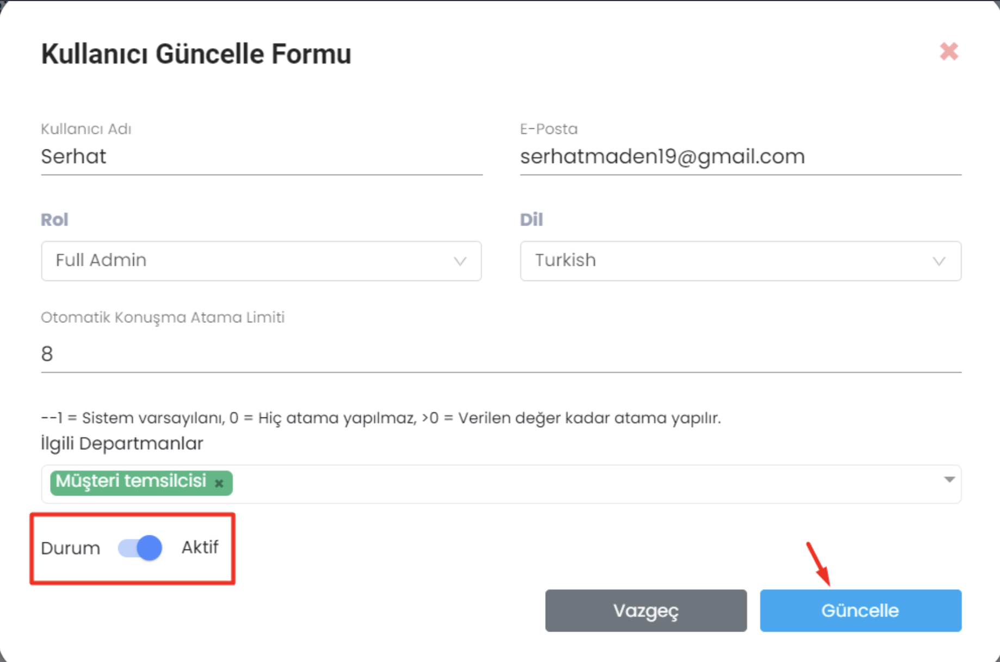

# Departmanlar

***

## Ziyaretcileri Departmantlara Bölme ve Departmant Temsilcilerine Otomatik Atama

Bu özellik, bir canlı destek sistemi için oldukça önemlidir ve birçok fayda sağlayabilir:

- <b>Daha hızlı yanıt süreleri:</b> Ziyaretçilerin ihtiyaçlarını doğru departmana yönlendirerek ve en uygun departman
  temsilcisine atayarak, yanıt süreleri önemli ölçüde kısaltılabilir. Bu, ziyaretçilerin memnuniyetini artırabilir ve
  işletmenin itibarını olumlu yönde etkileyebilir.
- <b>Verimlilik artışı:</b> Departmanları doğru şekilde ayırmak ve departman temsilcilerini otomatik olarak atamak,
  müşteri
  sorularının daha hızlı ve daha doğru şekilde yanıtlanmasına yardımcı olabilir. Bu da departmanların verimliliğini
  artırabilir.
- <b>Personel yönetimini kolaylaştırma:</b>Departmanlara müşteri yönlendirme ve departman temsilcilerine otomatik atama,
  personel yönetimini kolaylaştırabilir. Bu özellikler, departmanların iş yükünü eşit bir şekilde dağıtmaya yardımcı
  olabilir ve personelin performansını izlemek için veri sağlayabilir.
- <b>Müşteri memnuniyeti:</b> Doğru departmana yönlendirme ve en uygun departman temsilcisine atama, müşteri
  memnuniyetini
  artırabilir. Ziyaretçilerin doğru departmanla ve doğru kişiyle ilgilenmesi, işletmenin müşteri deneyimini
  iyileştirebilir.

Sonuç olarak, ziyaretçileri departmanlara bölme ve departman temsilcilerine otomatik atama özelliği, bir canlı destek
sistemi için oldukça önemlidir ve birçok fayda sağlayabilir.

<b>Ziyaretçileri departmanlara bölmek için yapmanız gerekenler:</b>

- ilk olarak Supsis.live girdiğiniz de ekranın sol tarafında bulunan yönetim panelinindeki Kullanıcılar kısmına
  tıklayın.
  
- Kullanıcılara girdikten sonra <b>Departmanlar</b> kısmına tıklayın.
  
- Departman eklemek için <b>Yeni Departman</b> butonuna tıklayın.
  

***

Bu adımda Başlık ve Açıklama kısımlarını doldurduktan sonra departmanı aktif veya pasif olarak ayarlayabilirsiniz. Sağ
alt köşede Kaydet butonuna tıkladıktan sonra yeni departman eklenmiş olacak.

***

## Departman Temsilcilerine otomatik atama yapmak için:

Kullanıcılara tıklayıp yeni kullancı ekle butonuna tıklayın ve yeni bir kullanıcı oluşturun ya da direkt olarak olan
kullanıcılarınız üzerinde departman değişikliği yapabilirsiniz.

İşaretlenmiş kısımda temsilcinizin sahip olduğu departman gözüküyor. Eğer departmanını değiştirmek istiyorsanız sağ
tarafta bulunan <b>"düzenleye"</b> basınız.

Burada alt kısımda bulunan işaretlenmiş olan ilgili departman'a basınız ve temsilcinize atamak istediğiniz departmanı
belirleyiniz.

***

Yine alt kısımdan pasif ya da aktif edebilirsiniz. Daha sonra da departman ataması yaptıktan sonra güncelleye basarak
temsilcinizin departmanını belirlemiş olacaksınız.

***

Supsis görüldüğü gibi kullanımı bu kadar basit bir arayüze sahip. Eğer herhangi bir sorun yaşarsanız destek ekibimiz
sizinle her zaman iletişime geçebilir. Sizin sorununuzu çözmekten mutluluk duyarız. Çünkü kullanıcılarımız bizler için
çok önemli. Supsis web sitemize [burdan](https://www.supsis.com) ulaşabilir ve destek talep edebilirsiniz.